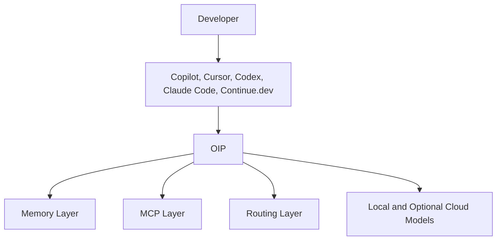

# Open Intelligence Platform (OIP)

> Build your own private AI environment. Own your knowledge. Control your costs.

## Overview

Open Intelligence Platform (OIP) is a Private AI Development Platform with Memory. It is an open-source platform for building private, provider-neutral AI environments with a first-class organizational memory layer. It combines knowledge management, retrieval-augmented generation, durable memory, model routing, governance, MCP-based tool integration, and model abstraction across local and cloud AI providers in one extensible architecture.

OIP is designed for developers, consultants, students, small businesses, delivery organizations, and enterprise teams that want AI capabilities without being locked into a single vendor or cloud.

The platform supports three deployment tiers:

- Developer or solo deployment
- Team or small business deployment
- Enterprise or production deployment

OIP is intentionally simple to start, but its architecture is designed to grow into enterprise-grade security, governance, operations, and integration requirements without redesigning the platform core.

Private First. Cloud Optional. Vendor Neutral.

The Memory Layer is the long-term knowledge system of OIP. Models may change over time, but organizational knowledge, engineering decisions, project history, and lessons learned remain preserved and continuously accessible.

Users retain ownership of knowledge, memory, documents, models, agents, MCP integrations, and workflows. Cloud providers are enhancements, not dependencies.

The MCP layer serves as the standardized tool integration backbone for all current and future OIP products including Delivery Wizard, PortalOps AI, EventEase AI, and WorkTime AI.

## Current Status

The repository now contains a production-oriented architecture package, open-source project foundation, and the first runnable backend implementation scaffold for the Memory First Foundation milestone.

The current implementation proves the first end-to-end platform path:

- Documents
- Memory
- Retrieval
- Ollama
- Grounded response

It also exposes an OpenAI-compatible API edge at `http://localhost:8080/v1` so tools such as `Continue.dev` can use OIP as the inference gateway while OIP keeps provider routing and local-model control.

The next milestone remains the broader runnable MVP described in [docs/mvp.md](docs/mvp.md), which adds the first frontend and expands provider support.

## Mission

OIP exists to make advanced AI systems practical, sovereign, and cost-governed. The platform gives teams a way to run local models when privacy or cost matters, use cloud models when capability or scale matters, and keep organizational knowledge under their own control.

OIP is a private AI development platform providing memory, knowledge, routing, governance, MCP integration, and model abstraction across local and cloud AI providers.

OIP is intended to behave as a trusted engineering partner. It is not a chatbot, not a replacement for engineers, and not just a model router. It is designed to help teams understand systems, preserve context, make informed decisions, and apply AI in ways that improve engineering outcomes.

Its operating values are:

- Curiosity over assumptions
- Simplicity over unnecessary complexity
- Systems thinking over isolated answers
- Transparency over false certainty
- Engineering judgment over blind automation
- Local-first execution with cloud as an optional enhancement

## Private AI Strategy

Local models are the preferred default.

- Local runtimes: `Ollama`, `vLLM`
- Recommended local models: `Qwen Coder`, `DeepSeek Coder`, `Llama`, `Mistral`

Cloud models are optional. Organizations can operate entirely on private infrastructure, keep sensitive information local, and add governed cloud providers only when they choose to.

Rationale:

- Cost control through local inference and selective cloud use
- Privacy by keeping sensitive knowledge and memory on private infrastructure
- Governance through local ownership of models, memory, and routing policy
- Availability through reduced dependency on external provider uptime
- Vendor independence through model and provider abstraction

## Features

- Local-first and cloud-optional model support through a unified routing layer
- First-class Memory Layer for preserving project, development, and organizational knowledge
- MCP integration backbone for tools, enterprise systems, repositories, databases, APIs, and future OIP services
- Retrieval-augmented generation for private knowledge bases
- Continuous knowledge learning from documents, interactions, and feedback
- Agent framework for coding, architecture, operations, documentation, and risk workflows
- Fine-tuning factory for dataset creation, training orchestration, and model lifecycle management
- Enterprise knowledge management with ownership, escalation, incident, runbook, and architecture decision capture
- Enterprise identity, policy, audit, governance, and cost-control foundations
- API-first platform design for UI, automation, and future product integrations
- Deployment flexibility across developer laptops, single servers, home labs, and Kubernetes clusters
- Security, observability, and governance designed in from the start

## Benefits

- Avoid vendor lock-in by abstracting model providers, vector stores, and deployment topologies
- Reduce cost by routing requests to the least expensive model that meets task requirements
- Improve privacy by running sensitive workloads locally
- Operate fully on private infrastructure when external AI providers are not acceptable
- Preserve institutional knowledge in a structured, searchable, continuously improving system
- Keep project history, engineering decisions, and lessons learned available even as models and providers change
- Support both individual productivity and enterprise-scale operations with the same platform model
- Give enterprise architects and platform teams a clear path from pilot deployment to production operations

## Architecture Summary

OIP uses a layered architecture:

- A `Next.js` web application provides the user experience for workspaces, knowledge, agents, and operations.
- A `Spring Boot` API layer exposes versioned APIs and enforces authentication, authorization, rate limits, quotas, and policy.
- Core services handle identity, workspaces, memory, knowledge ingestion and retrieval, model routing, provider and model registries, prompt governance, MCP governance, evaluation, cost governance, continuous learning, and training.
- Model providers are pluggable and support local runtimes such as `Ollama` and `vLLM`, as well as cloud providers such as `OpenAI`, `Anthropic`, `Google Gemini`, `OpenRouter`, and `DeepSeek`.
- Platform state is stored in `PostgreSQL`, vectors in `pgvector` or `ChromaDB`, and events in `Kafka`.
- Observability is implemented with `OpenTelemetry`, `Prometheus`, and `Grafana`, with audit and AI usage signals treated as first-class telemetry.

This architecture is intentionally extensible so future products such as Delivery Wizard, PortalOps AI, EventEase AI, and WorkTime AI can integrate through stable APIs, events, shared identity, memory services, MCP infrastructure, and optional domain adapters without redesigning the platform core.

## Developer Tool Positioning

OIP is not positioned as a replacement for `GitHub Copilot`, `Cursor`, `Claude Code`, `Codex`, `JetBrains AI Assistant`, or `Continue.dev`.

OIP serves those tools as:

- Memory Layer
- Knowledge Layer
- MCP Layer
- Routing Layer
- Governance Layer



## Enterprise Deployment Modes

1. Fully Private

- Local models
- Private infrastructure
- No external AI providers

2. Hybrid

- Local models
- Selective cloud usage

3. Enterprise Cloud

- Governed cloud providers
- Enterprise policies
- Audit controls

Each mode uses the same memory, routing, governance, and MCP architecture. The difference is deployment policy, not product redesign.

## Quick Start

The repository provides the architecture package, project governance files, and an initial runnable backend scaffold under `backend/` with local deployment assets under `deployment/docker/`.

1. Clone the repository.
2. Read [docs/vision.md](docs/vision.md), [docs/architecture.md](docs/architecture.md), and [docs/memory-layer.md](docs/memory-layer.md) to align on the platform model.
3. Start the local stack with `docker compose -f deployment/docker/docker-compose.yml up --build`.
4. Open the OpenAPI UI at `http://localhost:8080/swagger-ui.html`.
5. Create a workspace with `POST /api/v1/workspaces`.
6. Create a memory collection and memory entries with the Memory API.
7. Ask a grounded question with `POST /api/v1/ask`.

To use `Continue.dev` against OIP, configure:

```yaml
models:
  - title: OIP via Ollama
    provider: openai
    apiBase: http://localhost:8080/v1
    model: llama3.2:1b
```

OIP will expose `/v1/models` and `/v1/chat/completions` while routing the request to the enabled local Ollama model.

To build or test without Docker:

1. Run `mvn -f backend/pom.xml -pl oip-application -am package`.
2. Run `mvn -f backend/pom.xml test`.
3. Start the backend with `java -jar backend/oip-application/target/oip-application-0.1.0-SNAPSHOT.jar`.

## Next Milestone

The next milestone is a runnable MVP with:

- `Spring Boot` modular monolith backend
- `Next.js` frontend
- `PostgreSQL` with `pgvector`
- `Ollama` provider integration
- One OpenAI-compatible provider integration
- Basic model router
- Document ingestion, chunking, embeddings, and retrieval
- Initial project memory collections and source attribution
- Ask-question API
- Simple chat UI

Scope and success criteria are documented in [docs/mvp.md](docs/mvp.md).

The MVP is intentionally small, but every MVP component is designed as the first version of a production-grade enterprise capability.

The current scaffold intentionally excludes the frontend, MCP, agents, and fine-tuning so the foundation can validate memory ingestion, retrieval, routing, and grounded response generation first.

## Technology Stack

- Frontend: `React`, `Next.js`, `TypeScript`
- Backend: `Java 21`, `Spring Boot`, `Spring Security`, `Spring AI` patterns where appropriate
- AI Runtime: `Ollama`, `vLLM`
- Cloud AI Providers: `OpenAI`, `Anthropic`, `Google Gemini`, `OpenRouter`, `DeepSeek`
- Retrieval: `pgvector`, `ChromaDB`
- Database: `PostgreSQL`
- Messaging: `Kafka`
- Observability: `OpenTelemetry`, `Prometheus`, `Grafana`
- Deployment: `Docker`, `Docker Compose`, `Kubernetes`

Rationale is documented in [docs/technology-stack.md](docs/technology-stack.md).

## Roadmap

- Phase 0: Open Source Foundation
- Phase 1: Developer AI Workspace
- Phase 2: Team Knowledge Platform
- Phase 3: Enterprise AI Control Plane
- Phase 4: Agentic Delivery Platform
- Phase 4.5: MCP Integration Platform
- Phase 5: Organizational Intelligence
- Phase 6: Continuous Learning Platform
- Phase 7: Fine-Tuning Factory
- Phase 8: Enterprise Production Operations

See [docs/roadmap.md](docs/roadmap.md) for objectives and deliverables.

Build sequencing and implementation rules are documented in [docs/build-plan.md](docs/build-plan.md), [docs/implementation-principles.md](docs/implementation-principles.md), [docs/mvp-scope.md](docs/mvp-scope.md), and [docs/risk-register.md](docs/risk-register.md).

## Contribution Guide

We want OIP to be both open-source friendly and production-minded. The best contribution target right now is the runnable MVP and the supporting architecture and governance docs around it.

1. Start with the architecture package and propose changes through pull requests.
2. Keep APIs versioned and backward compatible.
3. Preserve pluggability for models, vector stores, and deployment targets.
4. Document architecture decisions and tradeoffs in Markdown.
5. Add observability, security, and operational considerations as part of each feature, not as follow-up work.

Recommended contribution flow:

- Open an issue describing the problem, use case, and impact
- Link the impacted architecture areas
- Submit a focused pull request with docs and implementation changes together
- Include tests, operational notes, and migration notes where relevant

See [CONTRIBUTING.md](CONTRIBUTING.md) for the full contribution workflow, MVP guardrails, and pull request expectations.

## Out of Scope for MVP

The MVP intentionally does not include:

- Large microservice scaffolding
- Multi-agent orchestration
- Fine-tuning pipelines
- Kafka-based event-driven platform services
- Full enterprise SSO, ABAC, and production operations automation
- Full organizational intelligence workflows

These remain part of the broader architecture and roadmap, but not the first runnable implementation.

## Repository Documents

- [docs/vision.md](docs/vision.md)
- [docs/architecture.md](docs/architecture.md)
- [docs/domain-model.md](docs/domain-model.md)
- [docs/knowledge-management.md](docs/knowledge-management.md)
- [docs/model-routing.md](docs/model-routing.md)
- [docs/developer-integrations.md](docs/developer-integrations.md)
- [docs/learning-pipeline.md](docs/learning-pipeline.md)
- [docs/build-plan.md](docs/build-plan.md)
- [docs/implementation-principles.md](docs/implementation-principles.md)
- [docs/mcp-architecture.md](docs/mcp-architecture.md)
- [docs/memory-layer.md](docs/memory-layer.md)
- [docs/mvp.md](docs/mvp.md)
- [docs/mvp-scope.md](docs/mvp-scope.md)
- [docs/rag-architecture.md](docs/rag-architecture.md)
- [docs/agent-framework.md](docs/agent-framework.md)
- [docs/risk-register.md](docs/risk-register.md)
- [docs/security.md](docs/security.md)
- [docs/observability.md](docs/observability.md)
- [docs/deployment.md](docs/deployment.md)
- [docs/technology-stack.md](docs/technology-stack.md)
- [docs/roadmap.md](docs/roadmap.md)
- [docs/openapi.md](docs/openapi.md)
- [docs/repository-structure.md](docs/repository-structure.md)
- [docs/adr/](docs/adr/)
