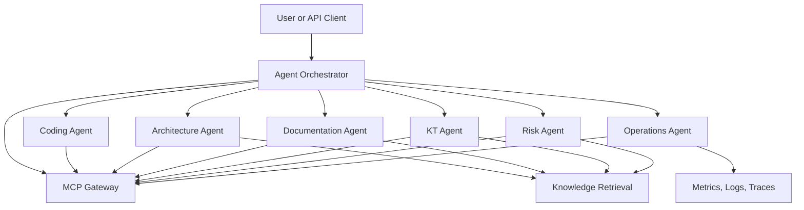

# Agent Framework

## Objective

OIP provides a governed multi-agent framework for high-value tasks that benefit from tools, memory, retrieval, workflow coordination, and MCP-based tool access.

## Agent Topology

## Agent Definitions

### Coding Agent

Responsibilities:
Generate, explain, refactor, review, and validate code changes.

Tools:
Repository access, test execution, static analysis, search, and architecture retrieval through the MCP layer.

Inputs:
Source code, user task, repo conventions, relevant design docs.

Outputs:
Code changes, review findings, test results, and implementation notes.

### Architecture Agent

Responsibilities:
Create solution designs, analyze tradeoffs, and maintain technical decision consistency.

Tools:
Knowledge retrieval, architecture templates, dependency analysis, and domain modeling utilities accessed through OIP services and the MCP layer.

Inputs:
Requirements, constraints, non-functional expectations, and existing architecture knowledge.

Outputs:
Architecture proposals, diagrams, decision records, and dependency impact assessments.

### Documentation Agent

Responsibilities:
Write and maintain README files, technical guides, runbooks, and operational documentation.

Tools:
Knowledge retrieval, repository inspection, template generation, and markdown publishing workflows through the MCP layer where tool execution is required.

Inputs:
Codebase state, architectural context, and user goals.

Outputs:
Markdown documents, release notes, runbooks, and knowledge updates.

### KT Agent

Responsibilities:
Capture knowledge-transfer material, summarize sessions, identify ownership, and publish reusable knowledge.

Tools:
Transcript processing, knowledge extraction, entity linking, retrieval, and governed tool access through the MCP layer.

Inputs:
Meeting notes, transcripts, project artifacts, and team mappings.

Outputs:
KT summaries, linked knowledge records, SME maps, and escalation metadata.

### Risk Agent

Responsibilities:
Identify technical, delivery, security, and operational risks.

Tools:
Knowledge retrieval, policy rules, architecture analysis, dependency scans, and governed external tool access through the MCP layer.

Inputs:
Project plans, designs, incidents, and governance rules.

Outputs:
Risk registers, mitigation suggestions, and escalation recommendations.

### Operations Agent

Responsibilities:
Assist with monitoring, troubleshooting, runbook execution guidance, and production insight synthesis.

Tools:
Metrics, logs, traces, runbooks, incidents, and knowledge retrieval through observability services and the MCP layer.

Inputs:
Operational telemetry, service health, and runbook data.

Outputs:
Operational summaries, probable causes, suggested actions, and incident knowledge updates.

## Why This Framework Works

- Specialized agents improve clarity and governance compared with one undifferentiated assistant.
- A shared orchestrator keeps execution policy, approval, tracing, and auditing consistent.
- MCP gives every agent the same governed tool backbone instead of duplicating integration logic inside each agent.
- Common knowledge and routing services let agents cooperate without tightly coupling their internals.
