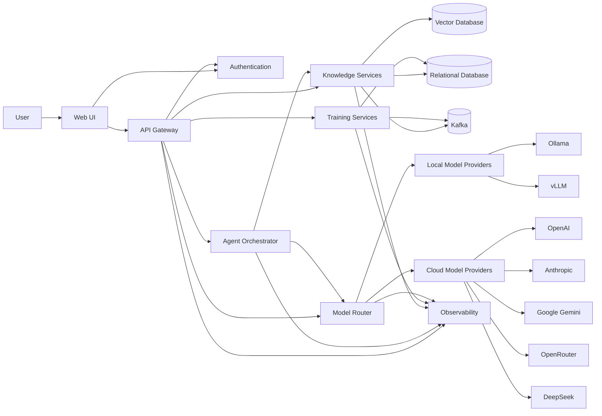
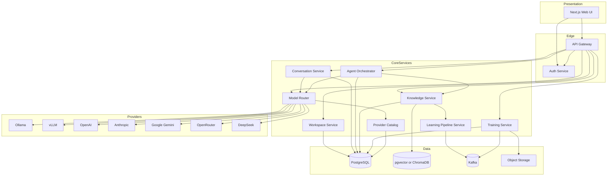
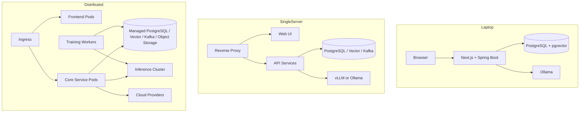
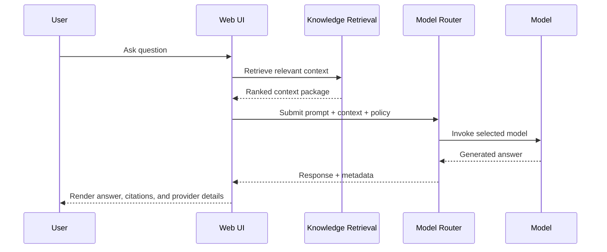
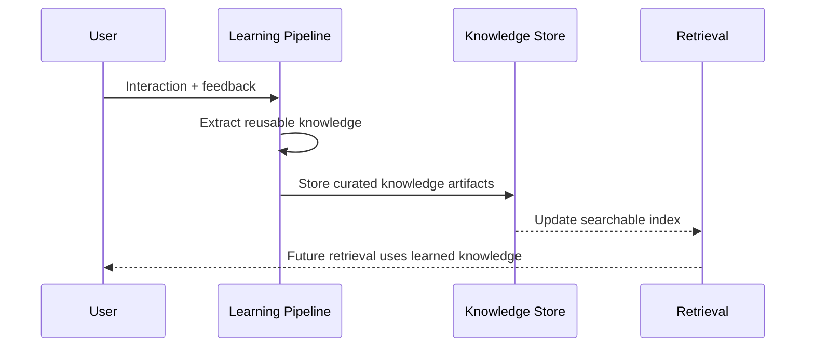
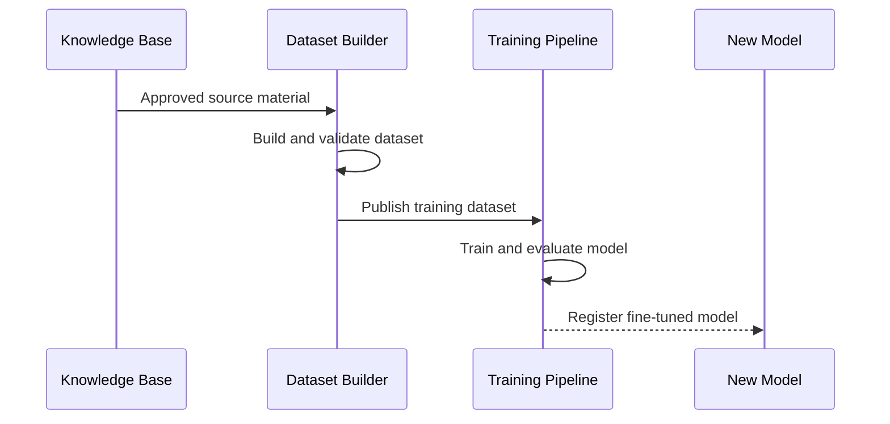

# Architecture

## Architectural Principles

- Provider neutrality: model providers, vector stores, and runtimes are abstracted behind stable interfaces
- Local-first optionality: the platform can prioritize local execution without excluding cloud augmentation
- API-first design: every major capability is exposed through versioned APIs and events
- Separation of concerns: knowledge learning, agent execution, and model training are independent pipelines
- Production readiness: security, auditability, and observability are first-class concerns
- Extensibility by contract: future products integrate through APIs, events, shared identity, and domain adapters rather than core rewrites

## High-Level Architecture

## Component Responsibilities

### Web UI

Provides workspace management, chat, retrieval experiences, agent task execution, model selection preferences, admin views, and operational dashboards. `Next.js` is a strong fit because it supports SSR, authenticated app experiences, and modular frontend growth.

### API Gateway

Acts as the single entry point for browser clients, automation clients, future product integrations, and external systems. Responsibilities include routing, rate limiting, request correlation, version negotiation, and policy enforcement. This layer prevents direct coupling between clients and internal services.

### Authentication

Handles identity federation, session management, token issuance and validation, and tenant or workspace context derivation. Centralizing this capability simplifies security posture and makes future multi-product integration consistent.

### Agent Orchestrator

Coordinates agent execution, tool invocation, workflow state, approvals, retries, and guardrails. It exists as a dedicated service because agent behavior should be governable and observable independently of UI chat flows.

### Knowledge Services

Own ingestion, chunking, embedding generation, indexing, retrieval, reranking, metadata enrichment, document lineage, and enterprise knowledge entities such as runbooks, incidents, KT sessions, SMEs, and ownership links. This service is separate from training because knowledge retrieval and model adaptation evolve at different speeds and have different risk profiles.

### Model Router

Selects the best provider and model for each task using policy, cost, latency, availability, capability, and user preference. The routing layer is central to vendor independence and cost control.

### Local Model Providers

Host models within user-controlled infrastructure. `Ollama` is suitable for developer friendliness and local experimentation. `vLLM` is suitable for higher-throughput inference, GPU serving, and enterprise-grade local model hosting.

### Cloud Model Providers

Provide access to premium capabilities when reasoning quality, multimodality, or scale demands it. Supporting multiple cloud providers keeps negotiation leverage and protects against pricing or availability shifts.

### Training Services

Manage dataset building, data validation, fine-tune orchestration, model packaging, evaluation, and model registry updates. This capability is isolated because training is resource-intensive, asynchronous, and operationally distinct from real-time inference.

### Vector Database

Stores embeddings and supports similarity search. OIP supports `pgvector` for operational simplicity and `ChromaDB` for teams that prefer a dedicated vector service.

### Relational Database

Stores metadata, configuration, workflow state, audit records, prompts, conversations, datasets, model records, and business entities. `PostgreSQL` is chosen because it is mature, extensible, and operationally efficient.

### Observability

Collects logs, metrics, traces, and health signals across every service. This is required to operate multi-model, multi-pipeline systems safely in production.

## Why This Architecture

- It supports both simple and advanced deployments without changing the core design.
- It avoids embedding provider-specific logic into UI or business workflows.
- It keeps real-time inference concerns separate from asynchronous learning and training concerns.
- It creates clear extension points for future products to consume knowledge, agents, routing, and identity services.

## Component Diagram

## Deployment Diagram

## Sequence Diagrams

### Ask Question

### Learn From Interaction

### Fine Tuning

