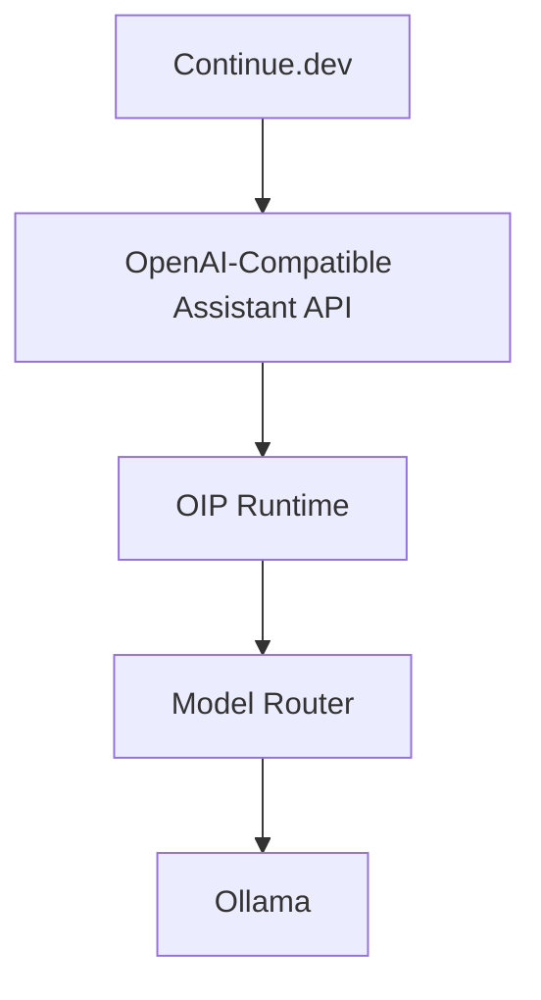
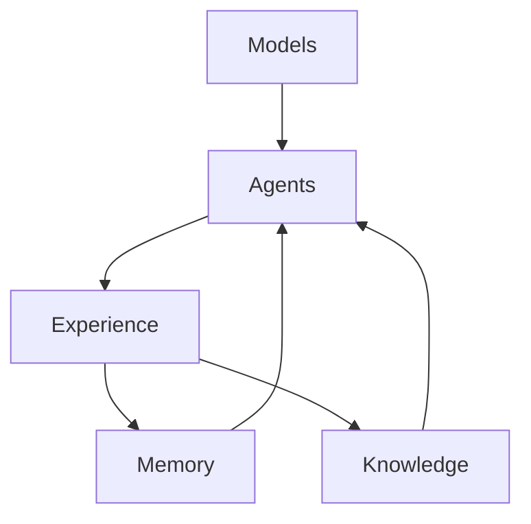
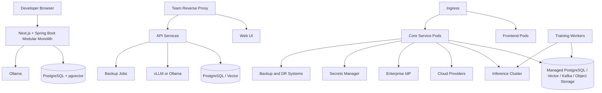
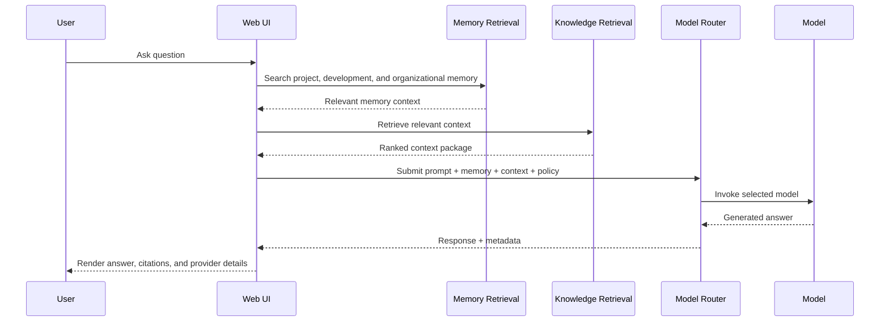
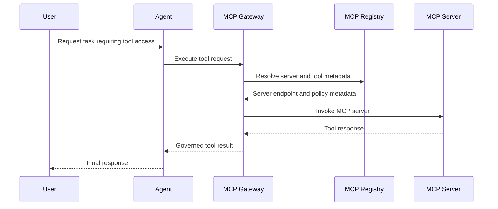
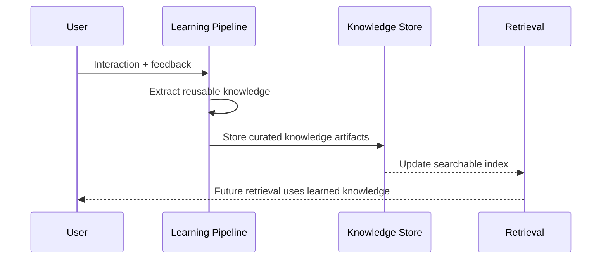
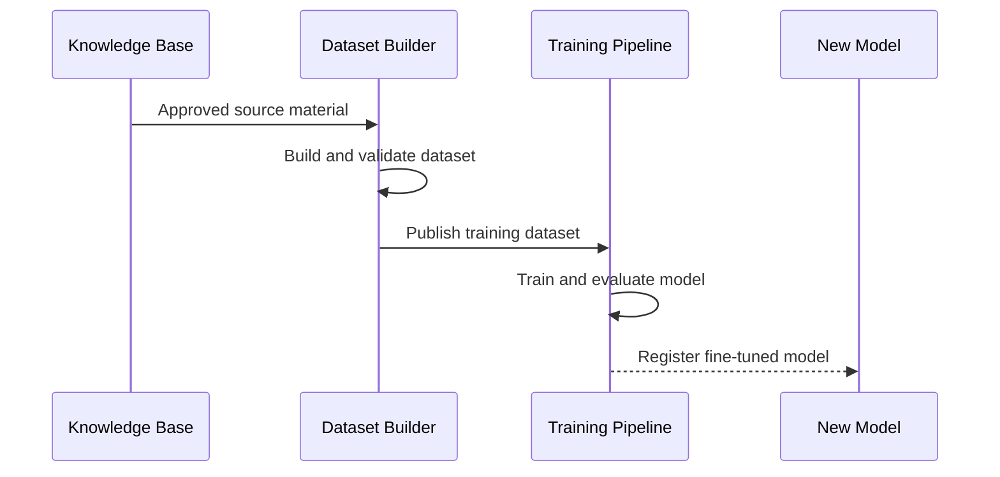

# Architecture

## Architectural Principles

- Provider neutrality: model providers, vector stores, and runtimes are abstracted behind stable interfaces
- Local-first optionality: the platform can prioritize local execution without excluding cloud augmentation
- Private first: the platform must be operable using private infrastructure and local models only
- Two-surface platform design: assistant-facing APIs and administration-facing UI evolve separately but share the same runtime and governance core
- API-first design: every major capability is exposed through versioned APIs and events
- Separation of concerns: knowledge learning, agent execution, and model training are independent pipelines
- Intelligence accumulation over time: models provide reasoning, while memory and knowledge preserve continuity, context, and experience across model changes
- Memory as a platform layer: durable memory is a core capability distinct from model inference and model training
- Knowledge as a platform layer: shared organizational intelligence is managed independently from memory and model providers
- MCP as a platform layer: tool access is standardized through MCP rather than embedded directly into agents or product-specific integrations
- Production readiness: security, auditability, and observability are first-class concerns
- Extensibility by contract: future products integrate through APIs, events, shared identity, and domain adapters rather than core rewrites
- Tiered deployment: the same architecture supports developer, team, and enterprise production deployments
- Governance by design: identity, policy, audit, registry, evaluation, and cost controls are platform services, not add-ons

Private First. Cloud Optional. Vendor Neutral.

## Intelligence Architecture

OIP is designed around four intelligence layers:

1. Models for reasoning
2. Memory for continuity
3. Knowledge for organizational context
4. Agents for execution

Large language models are static relative to the platform's accumulated experience. OIP improves over time by preserving memory, expanding knowledge, and recording outcomes independently of any single model provider.

## High-Level Architecture

```mermaid
flowchart TD
    Continue[Continue.dev]
    FutureClients[Future Assistant Clients]
    AdminUI[Administration UI]

    Continue --> AssistantAPI[Assistant API]
    FutureClients --> AssistantAPI
    AdminUI --> AdminAPI[Administration API]

    AssistantAPI --> APIGW[API Gateway]
    AdminAPI --> APIGW

    AdminUI --> Identity[Identity Service]
    APIGW --> Identity
    APIGW --> Policy[Policy Service]
    APIGW --> Workspace[Workspace Service]
    APIGW --> Memory[Memory Service]
    APIGW --> MemoryIndex[Memory Index Service]
    APIGW --> MemoryRetrieval[Memory Retrieval Service]
    APIGW --> MemoryGov[Memory Governance Service]
    APIGW --> MemoryAnalytics[Memory Analytics Service]
    APIGW --> Experience[Experience Service]
    APIGW --> Audit[Audit Service]
    APIGW --> Secrets[Secrets Service]
    APIGW --> Agent[Agent Orchestrator]
    APIGW --> MCPGateway[MCP Gateway]
    APIGW --> MCPRegistry[MCP Registry]
    APIGW --> MCPSecurity[MCP Security Service]
    APIGW --> MCPPolicy[MCP Policy Service]
    APIGW --> MCPAudit[MCP Audit Service]
    APIGW --> MCPMonitor[MCP Monitoring Service]
    APIGW --> Knowledge[Knowledge Services]
    APIGW --> Router[Model Router]
    APIGW --> ProviderRegistry[Provider Registry]
    APIGW --> ModelRegistry[Model Registry]
    APIGW --> PromptRegistry[Prompt Registry]
    APIGW --> Evaluation[Evaluation Service]
    APIGW --> Cost[Cost Governance Service]
    APIGW --> Training[Training Services]
    APIGW --> Ops[Deployment and Operations Service]

    Workspace --> ProviderRegistry
    Workspace --> ModelRegistry
    Workspace --> PromptRegistry
    Workspace --> Knowledge
    Workspace --> Memory
    Policy --> Agent
    Policy --> Knowledge
    Policy --> MemoryGov
    Policy --> Router
    Policy --> MCPPolicy
    Audit --> RDB[(Relational Database)]
    Secrets --> LocalModels[Local Model Providers]
    Secrets --> CloudModels[Cloud Model Providers]
    Memory --> MemoryIndex
    Memory --> MemoryGov
    Memory --> RDB
    MemoryIndex --> VectorDB[(Vector Database)]
    MemoryRetrieval --> MemoryIndex
    MemoryRetrieval --> Knowledge
    Experience --> Memory
    Experience --> Knowledge
    Experience --> Evaluation
    Experience --> RDB
    MemoryAnalytics --> Memory
    MemoryAnalytics --> RDB
    MemoryGov --> Audit
    Agent --> Knowledge
    Agent --> MemoryRetrieval
    Agent --> MCPGateway
    Agent --> Router
    MCPGateway --> MCPRegistry
    MCPGateway --> MCPSecurity
    MCPGateway --> MCPPolicy
    MCPGateway --> MCPAudit
    MCPGateway --> MCPMonitor
    MCPRegistry --> RDB
    MCPAudit --> RDB
    MCPSecurity --> Secrets
    Knowledge --> VectorDB[(Vector Database)]
    Knowledge --> RDB
    Knowledge --> Kafka[(Kafka)]
    Knowledge --> Evaluation
    Training --> RDB
    Training --> Kafka
    Training --> ModelRegistry
    PromptRegistry --> Router
    PromptRegistry --> Agent
    PromptRegistry --> MemoryRetrieval
    ProviderRegistry --> Router
    ModelRegistry --> Router
    Evaluation --> ModelRegistry
    Cost --> Router
    Ops --> APIGW
    Ops --> Training

    Router --> LocalModels[Local Model Providers]
    Router --> CloudModels[Cloud Model Providers]

    LocalModels --> Ollama[Ollama]
    LocalModels --> VLLM[vLLM]
    CloudModels --> OpenAI[OpenAI]
    CloudModels --> Anthropic[Anthropic]
    CloudModels --> Gemini[Google Gemini]
    CloudModels --> OpenRouter[OpenRouter]
    CloudModels --> DeepSeek[DeepSeek]

    APIGW --> Obs[Observability]
    AssistantAPI --> Obs
    AdminAPI --> Obs
    Identity --> Obs
    Policy --> Obs
    Memory --> Obs
    MemoryIndex --> Obs
    MemoryRetrieval --> Obs
    MemoryGov --> Obs
    MemoryAnalytics --> Obs
    Experience --> Obs
    Audit --> Obs
    MCPGateway --> Obs
    MCPRegistry --> Obs
    MCPSecurity --> Obs
    MCPPolicy --> Obs
    MCPAudit --> Obs
    MCPMonitor --> Obs
    Cost --> Obs
    Evaluation --> Obs
    Ops --> Obs
    Agent --> Obs
    Knowledge --> Obs
    Training --> Obs
    Router --> Obs
```



## Platform Surfaces

OIP consists of two surfaces:

1. Assistant API
   Used by `Continue` first, and later by other assistant clients.
2. Administration UI
   Used by administrators to manage models, memory, knowledge, tools, providers, monitoring, and settings.

The first validated integration is:



This proves OIP can act as the intelligence backend for AI coding assistants while keeping provider control inside OIP.

## Intelligence Layers in the Runtime



Models provide reasoning. Memory provides continuity. Knowledge provides context. Experience captures outcomes that can improve future behavior without retraining the underlying model.

## Component Responsibilities

### Administration UI

Provides administrative experiences for:

- model aliases and routing
- providers and health
- memory browsing and retention
- knowledge sources and indexing
- tool enablement
- monitoring and settings

This surface is part of the architecture now, even though it is not part of the first validated runtime milestone.

### Assistant API

Provides the assistant-facing protocol boundary. The first supported contract is OpenAI-compatible:

- `GET /v1/models`
- `POST /v1/chat/completions`
- `POST /v1/embeddings`

This surface exists so assistant clients can integrate with OIP without depending directly on raw provider APIs.

### API Gateway

Acts as the single entry point for browser clients, automation clients, future product integrations, and external systems. Responsibilities include routing, rate limiting, request correlation, version negotiation, and policy enforcement. This layer prevents direct coupling between clients and internal services.

### Identity Service

Handles local authentication, SSO, OIDC, SAML federation, service identities, token issuance and validation, directory synchronization hooks, and workspace context derivation. Centralizing this capability simplifies security posture and makes future multi-product integration consistent.

### Policy Service

Evaluates RBAC, ABAC, usage policies, safety policies, workspace boundaries, DLP rules, and approval requirements. Policy is modeled as a dedicated service so governance stays consistent across UI flows, APIs, agents, and future integrations.

### Audit Service

Captures security, governance, administrative, AI, and operational audit trails. It provides immutable evidence for who accessed what, which model was used, what policy was applied, what prompt version ran, and what action was approved or blocked.

### Secrets Service

Protects provider credentials, signing keys, connector secrets, and runtime configuration. This service bridges local secret storage for simple deployments and enterprise secret backends for production.

### Workspace Service

Owns workspace identity, membership, isolation boundaries, provider settings, knowledge access boundaries, budget settings, and environment-specific configuration. It is central to scaling from single-user use to controlled team and enterprise deployments.

### Memory Service

Owns the canonical memory model for project memory, development memory, and organizational memory. It stores memory collections, entries, relationships, tags, snapshots, and source lineage independently of any single model or provider.

### Memory Index Service

Transforms memory records into searchable structures through chunking, embedding, relationship indexing, metadata enrichment, and snapshot refresh. This service exists so memory indexing can evolve without rewriting the memory system itself.

### Memory Retrieval Service

Retrieves relevant memory before or alongside traditional knowledge retrieval. It combines project memory, development memory, and organizational memory with workspace, policy, and recency constraints to improve response quality over time.

### Memory Governance Service

Applies workspace isolation, data classification, retention rules, ownership controls, export, purge, and audit requirements to memory collections and entries. This makes memory durable but governable.

### Memory Analytics Service

Measures memory freshness, quality, duplication, coverage, and gap signals. It helps teams identify stale knowledge, missing ownership, repeated incidents, and under-documented delivery patterns.

### Experience Service

Captures outcomes, feedback, operational lessons, and reusable patterns that emerge from real assistant and agent usage. This service turns interactions into durable platform learning without coupling that learning to model retraining.

### Agent Orchestrator

Coordinates agent execution, MCP-based tool invocation, workflow state, approvals, retries, and guardrails. It exists as a dedicated service because agent behavior should be governable and observable independently of UI chat flows.

### MCP Gateway

Acts as the standardized execution layer between agents or platform services and MCP servers. It resolves tool requests, enforces connection flow, and keeps tool invocation logic out of individual agents.

### MCP Registry

Stores discoverable metadata for internal and external MCP servers, including ownership, endpoint, authentication type, capabilities, health status, certification state, and allowed workspaces.

### MCP Security Service

Protects MCP credentials, validates trust boundaries, and ensures that tool connections use approved authentication methods and secure transport.

### MCP Policy Service

Applies workspace isolation, tool allow lists, deny lists, approval requirements, rate limits, and execution permissions before any MCP tool call is allowed.

### MCP Audit Service

Captures auditable records for MCP registration changes, credential updates, tool executions, approvals, denials, and deprecations.

### MCP Monitoring Service

Tracks tool latency, failures, success rate, rate-limit behavior, and usage patterns across MCP servers and agents.

### Knowledge Services

Own ingestion, chunking, embedding generation, indexing, retrieval, reranking, metadata enrichment, document lineage, and enterprise knowledge entities such as runbooks, incidents, KT sessions, SMEs, and ownership links. This service is separate from training because knowledge retrieval and model adaptation evolve at different speeds and have different risk profiles.

### Model Router

Selects the best provider and model for each task using policy, cost, latency, availability, capability, safety, workspace preference, and fallback rules. The routing layer is central to vendor independence, cost control, and operational resilience.

Default policy should prefer local models first, then approved enterprise models, then optional cloud providers if policy allows.

In the validated assistant flow, the router is already responsible for translating OIP-facing aliases into internal model choices.

### Provider Registry

Maintains the catalog of configured providers, endpoints, capabilities, credentials references, health metadata, and allowed usage scopes. It allows enterprise teams to govern which providers are available in which environments and workspaces.

### Model Registry

Tracks available models, versions, context windows, capabilities, hosting mode, cost information, routing priority, evaluation status, promotion state, and release metadata. This is the control point for safe rollout and rollback of fine-tuned or newly approved models. Models are managed through the UI so new models can be added without code changes.

Assistant clients should not see raw provider model names directly. They should see OIP aliases such as:

- `oip-chat`
- `oip-plan`
- `oip-agent`
- `oip-embed`

The registry and router resolve those aliases internally.

### Prompt Registry

Stores prompt templates, versions, usage constraints, review status, and release mappings. This supports repeatable prompt engineering and governance instead of unmanaged prompt sprawl.

Prompt Registry also becomes the foundation for OIP runtime modes.

### Evaluation Service

Runs prompt and model evaluations against curated datasets, safety policies, and regression checks. It supports release gates, comparison runs, and response review workflows.

### Cost Governance Service

Tracks token usage, provider spending, workspace attribution, quotas, budgets, and routing economics. This service exists because enterprise AI adoption fails quickly when value and cost cannot be measured together.

### Local Model Providers

Host models within user-controlled infrastructure. `Ollama` is suitable for developer friendliness and local experimentation. `vLLM` is suitable for higher-throughput inference, GPU serving, and enterprise-grade local model hosting.

Recommended local model families include `Qwen Coder`, `DeepSeek Coder`, `Llama`, and `Mistral`.

### Cloud Model Providers

Provide optional access to premium capabilities when reasoning quality, multimodality, or scale demands it and policy allows it. Supporting multiple cloud providers keeps negotiation leverage and protects against pricing or availability shifts.

### Training Services

Manage dataset building, data validation, fine-tune orchestration, model packaging, evaluation, and model registry updates. This capability is isolated because training is resource-intensive, asynchronous, and operationally distinct from real-time inference.

Training is not the primary learning path for OIP. The primary learning path is memory, knowledge, and experience accumulation. Training remains optional and separate.

### Deployment and Operations Service

Coordinates deployment metadata, environment promotion, rollout strategies, health standards, operational runbook references, backup policies, and disaster recovery posture. This makes production operations part of the platform architecture rather than a hidden external concern.

### Vector Database

Stores embeddings and supports similarity search. OIP supports `pgvector` for operational simplicity and `ChromaDB` for teams that prefer a dedicated vector service.

### Relational Database

Stores metadata, configuration, workflow state, audit records, prompts, conversations, datasets, model records, and business entities. `PostgreSQL` is chosen because it is mature, extensible, and operationally efficient.

### Observability

Collects logs, metrics, traces, health signals, AI usage telemetry, and audit-correlated operational events across every service. This is required to operate multi-model, multi-pipeline systems safely in production.

## Why This Architecture

- It supports both simple and advanced deployments without changing the core design.
- It preserves organizational memory as a stable system even when models, prompts, or providers evolve.
- It preserves organizational knowledge as a durable context layer even when models, prompts, or providers evolve.
- It lets platform intelligence improve over time through memory, knowledge, and experience even if the underlying model remains unchanged.
- It allows fully private operation without any external AI provider dependency.
- It standardizes tool access through MCP so future products can reuse one governed integration backbone.
- It avoids embedding provider-specific logic into UI or business workflows.
- It keeps real-time inference concerns separate from asynchronous learning and training concerns.
- It creates clear extension points for future products to consume knowledge, agents, routing, governance, and identity services.
- It gives Delivery Wizard, PortalOps AI, EventEase AI, and WorkTime AI a reusable memory substrate without creating product-specific architectural branches.
- It gives enterprise architects explicit platform services for policy, audit, evaluation, cost, and operations.

## OIP Runtime Modes

OIP supports runtime modes that are implemented through prompts and routing rather than complex orchestration in the first implementation:

```text
CHAT
PLAN
AGENT
BACKGROUND
```

Initial intent:

- `CHAT`: explanations and general interaction
- `PLAN`: work breakdown, architecture planning, and reasoning
- `AGENT`: coding-oriented execution style
- `BACKGROUND`: reserved for future asynchronous work

These modes sit between assistant requests and provider routing. They are an OIP runtime concern, not a provider concern and not a client concern.

## Component Diagram

```mermaid
flowchart TD
    subgraph Presentation
        UI[Next.js Web UI]
        Admin[Admin Screens]
    end

    subgraph Edge
        APIGW[API Gateway]
        Identity[Identity Service]
        Policy[Policy Service]
    end

    subgraph CoreServices
        Workspace[Workspace Service]
        Memory[Memory Service]
        MemoryIndex[Memory Index Service]
        MemoryRetrieval[Memory Retrieval Service]
        MemoryGov[Memory Governance Service]
        MemoryAnalytics[Memory Analytics Service]
        Conversation[Conversation Service]
        Agent[Agent Orchestrator]
        MCPGateway[MCP Gateway]
        MCPRegistry[MCP Registry]
        MCPSecurity[MCP Security Service]
        MCPPolicy[MCP Policy Service]
        MCPAudit[MCP Audit Service]
        MCPMonitor[MCP Monitoring Service]
        Knowledge[Knowledge Service]
        Learning[Learning Pipeline Service]
        Router[Model Router]
        Training[Training Service]
        ProviderRegistry[Provider Registry]
        ModelRegistry[Model Registry]
        PromptRegistry[Prompt Registry]
        Evaluation[Evaluation Service]
        Cost[Cost Governance Service]
        Audit[Audit Service]
        Secrets[Secrets Service]
        Ops[Deployment and Operations Service]
    end

    subgraph Data
        Postgres[(PostgreSQL)]
        Vector[(pgvector or ChromaDB)]
        Kafka[(Kafka)]
        Blob[Object Storage]
    end

    subgraph Providers
        Ollama[Ollama]
        VLLM[vLLM]
        OpenAI[OpenAI]
        Anthropic[Anthropic]
        Gemini[Google Gemini]
        OpenRouter[OpenRouter]
        DeepSeek[DeepSeek]
    end

    subgraph MCPServers
        InternalMCP[Internal MCP Servers]
        ExternalMCP[External MCP Servers]
    end

    UI --> APIGW
    Admin --> APIGW
    UI --> Identity
    APIGW --> Identity
    APIGW --> Policy
    APIGW --> Workspace
    APIGW --> Memory
    APIGW --> MemoryIndex
    APIGW --> MemoryRetrieval
    APIGW --> MemoryGov
    APIGW --> MemoryAnalytics
    APIGW --> Conversation
    APIGW --> Agent
    APIGW --> MCPGateway
    APIGW --> MCPRegistry
    APIGW --> MCPSecurity
    APIGW --> MCPPolicy
    APIGW --> MCPAudit
    APIGW --> MCPMonitor
    APIGW --> Knowledge
    APIGW --> Router
    APIGW --> Training
    APIGW --> ProviderRegistry
    APIGW --> ModelRegistry
    APIGW --> PromptRegistry
    APIGW --> Evaluation
    APIGW --> Cost
    APIGW --> Audit
    APIGW --> Secrets
    APIGW --> Ops

    Workspace --> Memory
    Conversation --> Router
    Agent --> Router
    Agent --> Knowledge
    Agent --> MemoryRetrieval
    Agent --> MCPGateway
    Agent --> PromptRegistry
    MCPGateway --> MCPRegistry
    MCPGateway --> MCPSecurity
    MCPGateway --> MCPPolicy
    MCPGateway --> MCPAudit
    MCPGateway --> MCPMonitor
    MCPGateway --> InternalMCP
    MCPGateway --> ExternalMCP
    MCPRegistry --> Postgres
    MCPAudit --> Postgres
    Memory --> MemoryIndex
    Memory --> Postgres
    MemoryIndex --> Vector
    MemoryRetrieval --> MemoryIndex
    MemoryRetrieval --> Knowledge
    MemoryGov --> Audit
    MemoryAnalytics --> Postgres
    Knowledge --> Learning
    Knowledge --> Evaluation
    Learning --> Kafka
    Training --> Kafka
    Training --> ModelRegistry
    ProviderRegistry --> Router
    ModelRegistry --> Router
    Cost --> Router
    Policy --> Agent
    Policy --> Knowledge
    Policy --> Router

    Workspace --> Postgres
    Conversation --> Postgres
    Agent --> Postgres
    Knowledge --> Postgres
    Knowledge --> Vector
    Training --> Postgres
    Training --> Blob
    ProviderRegistry --> Postgres
    ModelRegistry --> Postgres
    PromptRegistry --> Postgres
    Evaluation --> Postgres
    Audit --> Postgres
    Cost --> Postgres
    Ops --> Postgres

    Router --> Ollama
    Router --> VLLM
    Router --> OpenAI
    Router --> Anthropic
    Router --> Gemini
    Router --> OpenRouter
    Router --> DeepSeek
    Secrets --> Ollama
    Secrets --> VLLM
    Secrets --> OpenAI
    Secrets --> Anthropic
    Secrets --> Gemini
    Secrets --> OpenRouter
    Secrets --> DeepSeek
```



## Deployment Diagram



## Deployment Tiers

OIP is intentionally designed for three operating tiers:

- Developer or solo deployment for fast local startup and private experimentation
- Team or small business deployment for shared usage, controlled access, and low-overhead operations
- Enterprise or production deployment for SSO, policy control, HA, DR, promotion workflows, and governance at scale

The architecture does not force all users into enterprise complexity up front. It introduces enterprise services as first-class capabilities so the platform can grow without redesign.

## Enterprise Deployment Modes

### Fully Private

- Local models
- Private infrastructure
- No external AI providers

### Hybrid

- Local models
- Selective cloud usage

### Enterprise Cloud

- Governed cloud providers
- Enterprise policies
- Audit controls

Each mode uses the same memory, routing, governance, and MCP architecture. Cloud providers are optional extensions to the core platform, not architectural dependencies.

## Sequence Diagrams

### Ask Question



### MCP Tool Execution



### Learn From Interaction



### Fine Tuning


