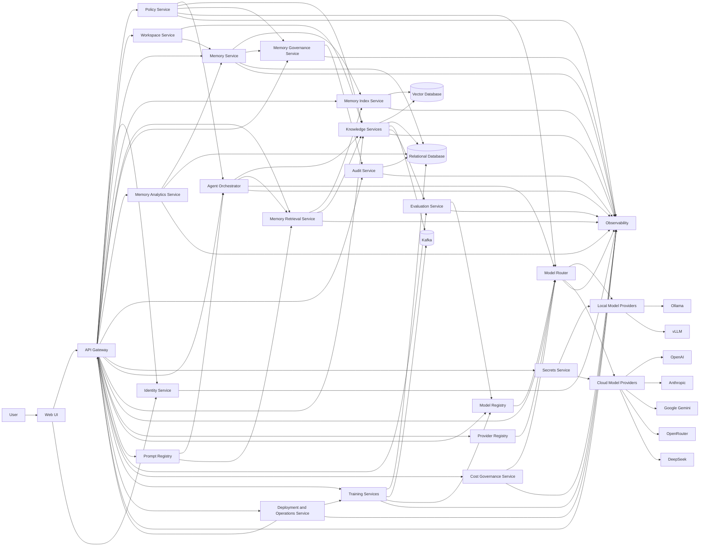
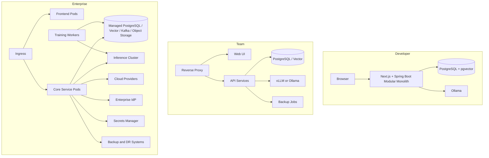
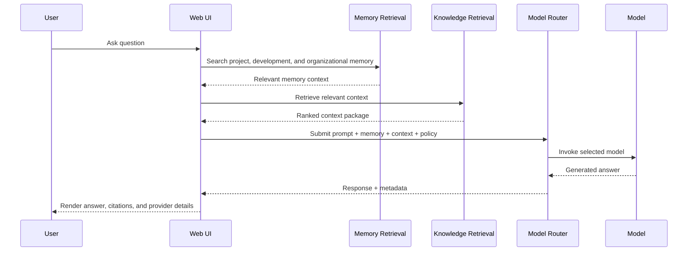
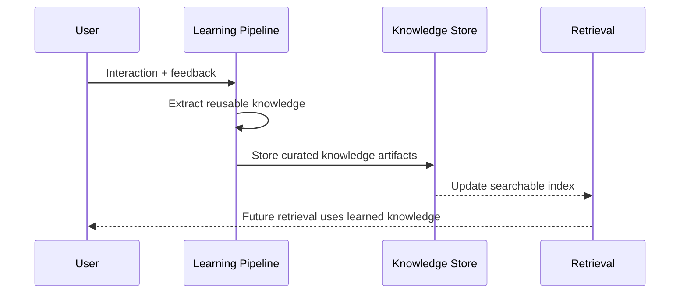
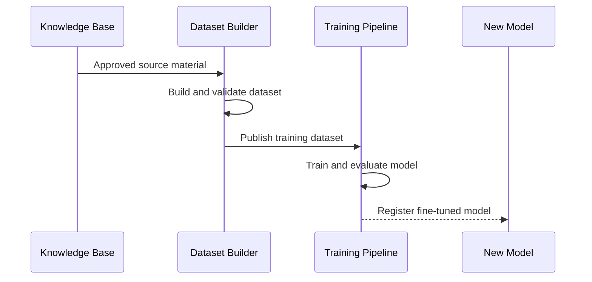

# Architecture

## Architectural Principles

- Provider neutrality: model providers, vector stores, and runtimes are abstracted behind stable interfaces
- Local-first optionality: the platform can prioritize local execution without excluding cloud augmentation
- API-first design: every major capability is exposed through versioned APIs and events
- Separation of concerns: knowledge learning, agent execution, and model training are independent pipelines
- Memory as a platform layer: durable memory is a core capability distinct from model inference and model training
- Production readiness: security, auditability, and observability are first-class concerns
- Extensibility by contract: future products integrate through APIs, events, shared identity, and domain adapters rather than core rewrites
- Tiered deployment: the same architecture supports developer, team, and enterprise production deployments
- Governance by design: identity, policy, audit, registry, evaluation, and cost controls are platform services, not add-ons

## High-Level Architecture

## Component Responsibilities

### Web UI

Provides workspace management, chat, retrieval experiences, agent task execution, model selection preferences, admin views, and operational dashboards. `Next.js` is a strong fit because it supports SSR, authenticated app experiences, and modular frontend growth.

### API Gateway

Acts as the single entry point for browser clients, automation clients, future product integrations, and external systems. Responsibilities include routing, rate limiting, request correlation, version negotiation, and policy enforcement. This layer prevents direct coupling between clients and internal services.

### Identity Service

Handles local authentication, SSO, OIDC, SAML federation, service identities, token issuance and validation, directory synchronization hooks, and workspace context derivation. Centralizing this capability simplifies security posture and makes future multi-product integration consistent.

### Policy Service

Evaluates RBAC, ABAC, usage policies, safety policies, workspace boundaries, DLP rules, and approval requirements. Policy is modeled as a dedicated service so governance stays consistent across UI flows, APIs, agents, and future integrations.

### Audit Service

Captures security, governance, administrative, AI, and operational audit trails. It provides immutable evidence for who accessed what, which model was used, what policy was applied, what prompt version ran, and what action was approved or blocked.

### Secrets Service

Protects provider credentials, signing keys, connector secrets, and runtime configuration. This service bridges local secret storage for simple deployments and enterprise secret backends for production.

### Workspace Service

Owns workspace identity, membership, isolation boundaries, provider settings, knowledge access boundaries, budget settings, and environment-specific configuration. It is central to scaling from single-user use to controlled team and enterprise deployments.

### Memory Service

Owns the canonical memory model for project memory, development memory, and organizational memory. It stores memory collections, entries, relationships, tags, snapshots, and source lineage independently of any single model or provider.

### Memory Index Service

Transforms memory records into searchable structures through chunking, embedding, relationship indexing, metadata enrichment, and snapshot refresh. This service exists so memory indexing can evolve without rewriting the memory system itself.

### Memory Retrieval Service

Retrieves relevant memory before or alongside traditional knowledge retrieval. It combines project memory, development memory, and organizational memory with workspace, policy, and recency constraints to improve response quality over time.

### Memory Governance Service

Applies workspace isolation, data classification, retention rules, ownership controls, export, purge, and audit requirements to memory collections and entries. This makes memory durable but governable.

### Memory Analytics Service

Measures memory freshness, quality, duplication, coverage, and gap signals. It helps teams identify stale knowledge, missing ownership, repeated incidents, and under-documented delivery patterns.

### Agent Orchestrator

Coordinates agent execution, tool invocation, workflow state, approvals, retries, and guardrails. It exists as a dedicated service because agent behavior should be governable and observable independently of UI chat flows.

### Knowledge Services

Own ingestion, chunking, embedding generation, indexing, retrieval, reranking, metadata enrichment, document lineage, and enterprise knowledge entities such as runbooks, incidents, KT sessions, SMEs, and ownership links. This service is separate from training because knowledge retrieval and model adaptation evolve at different speeds and have different risk profiles.

### Model Router

Selects the best provider and model for each task using policy, cost, latency, availability, capability, safety, workspace preference, and fallback rules. The routing layer is central to vendor independence, cost control, and operational resilience.

### Provider Registry

Maintains the catalog of configured providers, endpoints, capabilities, credentials references, health metadata, and allowed usage scopes. It allows enterprise teams to govern which providers are available in which environments and workspaces.

### Model Registry

Tracks available models, versions, capabilities, hosting mode, evaluation status, promotion state, and release metadata. This is the control point for safe rollout and rollback of fine-tuned or newly approved models.

### Prompt Registry

Stores prompt templates, versions, usage constraints, review status, and release mappings. This supports repeatable prompt engineering and governance instead of unmanaged prompt sprawl.

### Evaluation Service

Runs prompt and model evaluations against curated datasets, safety policies, and regression checks. It supports release gates, comparison runs, and response review workflows.

### Cost Governance Service

Tracks token usage, provider spending, workspace attribution, quotas, budgets, and routing economics. This service exists because enterprise AI adoption fails quickly when value and cost cannot be measured together.

### Local Model Providers

Host models within user-controlled infrastructure. `Ollama` is suitable for developer friendliness and local experimentation. `vLLM` is suitable for higher-throughput inference, GPU serving, and enterprise-grade local model hosting.

### Cloud Model Providers

Provide access to premium capabilities when reasoning quality, multimodality, or scale demands it. Supporting multiple cloud providers keeps negotiation leverage and protects against pricing or availability shifts.

### Training Services

Manage dataset building, data validation, fine-tune orchestration, model packaging, evaluation, and model registry updates. This capability is isolated because training is resource-intensive, asynchronous, and operationally distinct from real-time inference.

### Deployment and Operations Service

Coordinates deployment metadata, environment promotion, rollout strategies, health standards, operational runbook references, backup policies, and disaster recovery posture. This makes production operations part of the platform architecture rather than a hidden external concern.

### Vector Database

Stores embeddings and supports similarity search. OIP supports `pgvector` for operational simplicity and `ChromaDB` for teams that prefer a dedicated vector service.

### Relational Database

Stores metadata, configuration, workflow state, audit records, prompts, conversations, datasets, model records, and business entities. `PostgreSQL` is chosen because it is mature, extensible, and operationally efficient.

### Observability

Collects logs, metrics, traces, health signals, AI usage telemetry, and audit-correlated operational events across every service. This is required to operate multi-model, multi-pipeline systems safely in production.

## Why This Architecture

- It supports both simple and advanced deployments without changing the core design.
- It preserves organizational memory as a stable system even when models, prompts, or providers evolve.
- It avoids embedding provider-specific logic into UI or business workflows.
- It keeps real-time inference concerns separate from asynchronous learning and training concerns.
- It creates clear extension points for future products to consume knowledge, agents, routing, governance, and identity services.
- It gives Delivery Wizard, PortalOps AI, EventEase AI, and WorkTime AI a reusable memory substrate without creating product-specific architectural branches.
- It gives enterprise architects explicit platform services for policy, audit, evaluation, cost, and operations.

## Component Diagram

```mermaid
flowchart TB
    subgraph Presentation
        UI[Next.js Web UI]
    end

    subgraph Edge
        APIGW[API Gateway]
        Identity[Identity Service]
        Policy[Policy Service]
    end

    subgraph CoreServices
        Workspace[Workspace Service]
        Memory[Memory Service]
        MemoryIndex[Memory Index Service]
        MemoryRetrieval[Memory Retrieval Service]
        MemoryGov[Memory Governance Service]
        MemoryAnalytics[Memory Analytics Service]
        Conversation[Conversation Service]
        Agent[Agent Orchestrator]
        Knowledge[Knowledge Service]
        Learning[Learning Pipeline Service]
        Router[Model Router]
        Training[Training Service]
        ProviderRegistry[Provider Registry]
        ModelRegistry[Model Registry]
        PromptRegistry[Prompt Registry]
        Evaluation[Evaluation Service]
        Cost[Cost Governance Service]
        Audit[Audit Service]
        Secrets[Secrets Service]
        Ops[Deployment and Operations Service]
    end

    subgraph Data
        Postgres[(PostgreSQL)]
        Vector[(pgvector or ChromaDB)]
        Kafka[(Kafka)]
        Blob[Object Storage]
    end

    subgraph Providers
        Ollama[Ollama]
        VLLM[vLLM]
        OpenAI[OpenAI]
        Anthropic[Anthropic]
        Gemini[Google Gemini]
        OpenRouter[OpenRouter]
        DeepSeek[DeepSeek]
    end

    UI --> APIGW
    UI --> Identity
    APIGW --> Identity
    APIGW --> Policy
    APIGW --> Workspace
    APIGW --> Memory
    APIGW --> MemoryIndex
    APIGW --> MemoryRetrieval
    APIGW --> MemoryGov
    APIGW --> MemoryAnalytics
    APIGW --> Conversation
    APIGW --> Agent
    APIGW --> Knowledge
    APIGW --> Router
    APIGW --> Training
    APIGW --> ProviderRegistry
    APIGW --> ModelRegistry
    APIGW --> PromptRegistry
    APIGW --> Evaluation
    APIGW --> Cost
    APIGW --> Audit
    APIGW --> Secrets
    APIGW --> Ops

    Workspace --> Memory
    Conversation --> Router
    Agent --> Router
    Agent --> Knowledge
    Agent --> MemoryRetrieval
    Agent --> PromptRegistry
    Memory --> MemoryIndex
    Memory --> Postgres
    MemoryIndex --> Vector
    MemoryRetrieval --> MemoryIndex
    MemoryRetrieval --> Knowledge
    MemoryGov --> Audit
    MemoryAnalytics --> Postgres
    Knowledge --> Learning
    Knowledge --> Evaluation
    Learning --> Kafka
    Training --> Kafka
    Training --> ModelRegistry
    ProviderRegistry --> Router
    ModelRegistry --> Router
    Cost --> Router
    Policy --> Agent
    Policy --> Knowledge
    Policy --> Router

    Workspace --> Postgres
    Conversation --> Postgres
    Agent --> Postgres
    Knowledge --> Postgres
    Knowledge --> Vector
    Training --> Postgres
    Training --> Blob
    ProviderRegistry --> Postgres
    ModelRegistry --> Postgres
    PromptRegistry --> Postgres
    Evaluation --> Postgres
    Audit --> Postgres
    Cost --> Postgres
    Ops --> Postgres

    Router --> Ollama
    Router --> VLLM
    Router --> OpenAI
    Router --> Anthropic
    Router --> Gemini
    Router --> OpenRouter
    Router --> DeepSeek
    Secrets --> Ollama
    Secrets --> VLLM
    Secrets --> OpenAI
    Secrets --> Anthropic
    Secrets --> Gemini
    Secrets --> OpenRouter
    Secrets --> DeepSeek
```

## Deployment Diagram

## Deployment Tiers

OIP is intentionally designed for three operating tiers:

- Developer or solo deployment for fast local startup and private experimentation
- Team or small business deployment for shared usage, controlled access, and low-overhead operations
- Enterprise or production deployment for SSO, policy control, HA, DR, promotion workflows, and governance at scale

The architecture does not force all users into enterprise complexity up front. It introduces enterprise services as first-class capabilities so the platform can grow without redesign.

## Sequence Diagrams

### Ask Question

### Learn From Interaction

### Fine Tuning

