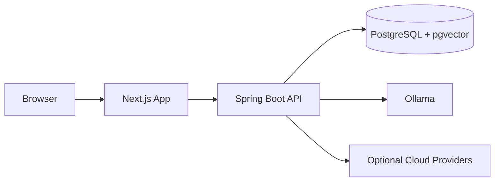
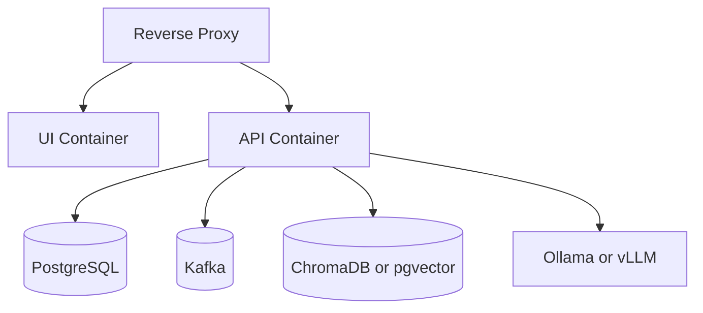
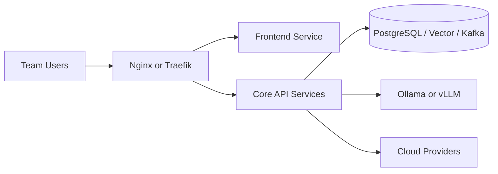
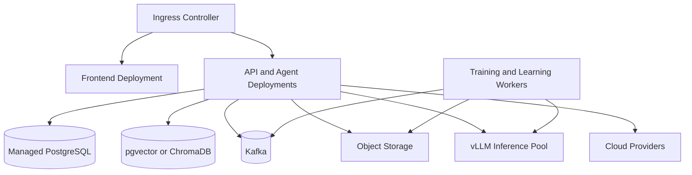

# Deployment

## Deployment Philosophy

OIP supports multiple deployment shapes without changing the core architecture. The same logical platform can run on a developer laptop, a home lab or single server, and a distributed enterprise Kubernetes environment.

## Developer Laptop

Best for individual developers, students, and early contributors.

Characteristics:

- Docker Compose or local process-based development
- Embedded or lightweight service topology
- Local PostgreSQL with `pgvector`
- `Ollama` for local inference
- Optional cloud providers for higher-capability tasks

## Docker Compose

Best for local integration testing and small self-hosted teams.

Characteristics:

- Separate containers for UI, API, PostgreSQL, Kafka, and vector service if needed
- Reverse proxy for unified local access
- Local persistent volumes
- Good stepping stone between laptop development and server deployment

## Home Lab or Single Server

Best for small businesses, consultants, and delivery teams that want private hosting with modest operational overhead.

Characteristics:

- One VM or physical server
- Containerized services behind reverse proxy
- Local GPU optional for `vLLM`
- Suitable for team-wide knowledge and agent workflows

## Enterprise Kubernetes

Best for organizations that need scale, segmentation, HA, and operational rigor.

Characteristics:

- Kubernetes for service orchestration
- Managed PostgreSQL, Kafka, and object storage where appropriate
- Dedicated inference pools for `vLLM`
- Centralized observability and secrets management
- Optional multi-tenant or multi-workspace deployment patterns

## Why This Deployment Model

- It allows gradual adoption from one user to many teams.
- It avoids re-architecture as maturity grows.
- It supports privacy-sensitive local inference and cloud augmentation in the same operating model.
