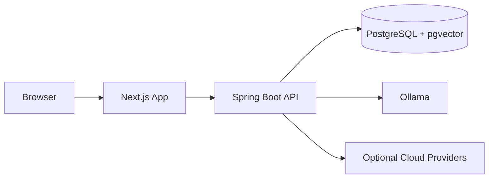
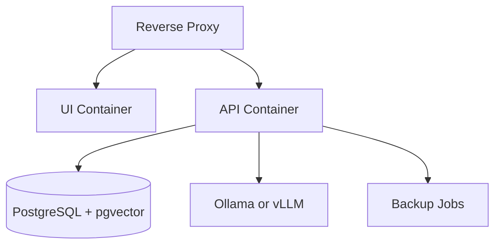
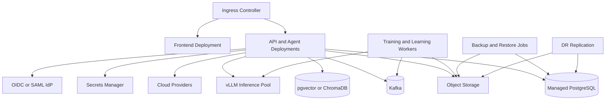

# Deployment

## Deployment Philosophy

OIP supports multiple deployment shapes without changing the core architecture. The same logical platform can run as a developer environment, a team-serving single node, and a distributed enterprise Kubernetes deployment.

The platform supports three deployment tiers:

- Developer or solo deployment
- Team or small business deployment
- Enterprise or production deployment

This lets users start small while preserving a clear path to enterprise production operations.

## Docker Compose for Developer Use

Best for individual developers, students, and early contributors.

Characteristics:

- Docker Compose or local process-based development
- Embedded or lightweight service topology
- Local PostgreSQL with `pgvector`
- `Ollama` for local inference
- Optional cloud providers for higher-capability tasks

## Single-Node Server for Small Teams

Best for consultants, small businesses, and delivery teams that want shared access with modest operational overhead.

Characteristics:

- One VM or physical server
- Reverse proxy with TLS termination
- Containerized UI, API, PostgreSQL, and local inference service
- Local persistent volumes and scheduled backups
- Shared workspaces, provider configuration, and basic role management

## Kubernetes for Enterprise

Best for organizations that need scale, segmentation, HA, and operational rigor.

Characteristics:

- Kubernetes for service orchestration
- Managed or HA PostgreSQL, Kafka, and object storage where appropriate
- Dedicated inference pools for `vLLM`
- Centralized observability and secrets management
- Ingress, autoscaling, readiness checks, and rolling or blue-green rollout support
- Environment promotion across development, test, staging, and production
- Backup, restore, and DR integration

## Environment Promotion Strategy

Enterprise deployments should separate environments and promote changes intentionally:

- `dev` for active development and integration work
- `test` for automated validation and contract checks
- `staging` for release candidate verification, evaluation runs, and operational signoff
- `production` for controlled rollout to end users

Promotion should carry forward:

- Application versions
- Database migrations
- Provider and model configuration
- Prompt versions
- Evaluation baselines
- Policy bundles

## High Availability Strategy

Enterprise HA should include:

- Multiple frontend and API replicas
- Readiness and liveness checks
- Rolling or blue-green deployment support
- HA PostgreSQL or managed database failover
- Redundant ingress and load balancing
- Provider fallback routing between local and cloud options

## Backup and Restore Strategy

Backup design should cover:

- PostgreSQL full and point-in-time backups
- Vector and object storage backups or rebuild procedures
- Configuration backups for provider, model, prompt, and policy registries
- Restore validation through scheduled drills

## Disaster Recovery Strategy

DR planning should define:

- Recovery point objective and recovery time objective targets
- Secondary-region or secondary-site data replication where justified
- Runbooks for provider failover, database recovery, and environment rebuild
- Priority order for restoring identity, data, API, and AI inference dependencies

## Health and Readiness Standards

All deployment tiers should expose:

- Liveness checks
- Readiness checks
- Dependency-aware health checks
- Synthetic ask-question probes for canary validation
- Operational runbooks linked to alerts and recovery steps

## Why This Deployment Model

- It allows gradual adoption from one user to many teams.
- It avoids re-architecture as maturity grows.
- It supports privacy-sensitive local inference and cloud augmentation in the same operating model.
- It gives enterprise operators a credible path to HA, recovery, promotion, and governance.
