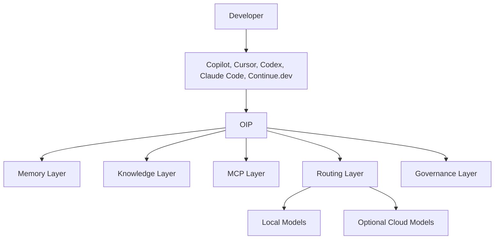
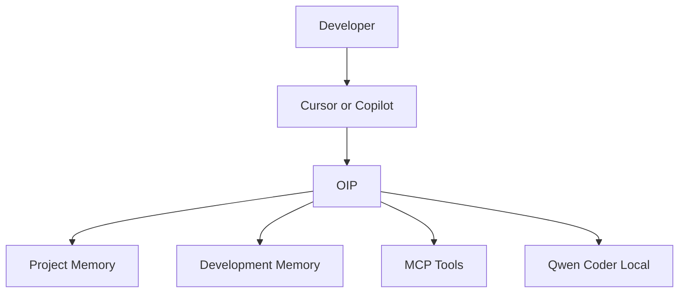
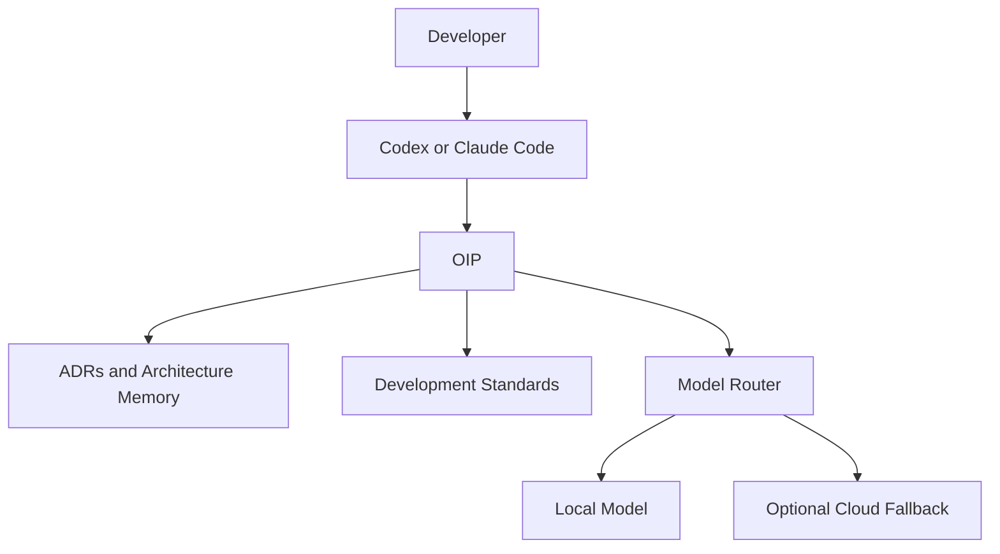

# Developer Integrations

## Purpose

OIP is not positioned as a replacement for developer assistants such as `GitHub Copilot`, `Cursor`, `Claude Code`, `Codex`, `JetBrains AI Assistant`, or `Continue.dev`.

OIP provides the platform services those tools can use:

- Memory Layer
- Knowledge Layer
- MCP Layer
- Routing Layer
- Governance Layer

Private First. Cloud Optional. Vendor Neutral.

## Positioning

Developer assistants focus on interaction at the editor or task surface. OIP focuses on long-lived knowledge, governed model routing, reusable tool integration, and enterprise controls behind that interaction surface.

That separation matters because assistants may change over time. Memory remains. Routing policy remains. MCP integrations remain. Governance remains.

## Integration Model

## Example Flows

### Coding

### Architecture

## Why OIP Sits Behind Developer Tools

- Memory survives tool changes
- Routing policy survives provider changes
- MCP integration survives model changes
- Governance survives workflow changes
- Knowledge remains under organizational ownership

## Ownership Model

Users and organizations retain ownership of:

- Knowledge
- Memory
- Documents
- Models
- Agents
- MCP integrations
- Workflows

Developer tools are consumers of OIP capabilities, not owners of those assets.
