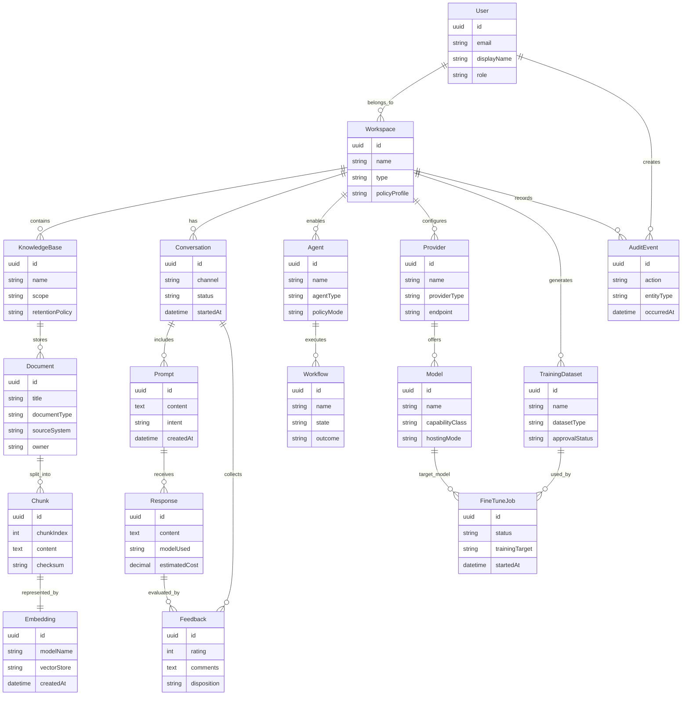

# Domain Model

## Overview

The OIP domain model separates platform identity, knowledge assets, AI interactions, model infrastructure, and governance records. This structure keeps user-facing workflows clear while allowing the platform to evolve from a single-user environment into a multi-team system.

## Entity Relationship Diagram

## Relationship Explanation

### User and Workspace

A user can belong to multiple workspaces because consultants, delivery leads, and enterprise staff often operate across teams or clients. A workspace is the primary boundary for policies, providers, knowledge scope, and auditability.

### Workspace and KnowledgeBase

A workspace can contain one or more knowledge bases so teams can separate product, client, operations, or regulatory content without duplicating platform infrastructure.

### KnowledgeBase, Document, Chunk, and Embedding

Documents are the authoritative units of ingested content. Each document is chunked for retrieval, and each chunk is represented by an embedding. Keeping chunk and embedding as explicit entities preserves lineage, re-indexing flexibility, and auditability.

### Conversation, Prompt, Response, and Feedback

Conversations capture a sequence of prompts and responses. Feedback is attached to responses and conversations so OIP can distinguish between operational satisfaction, factual correction, and reusable learning signals.

### Agent and Workflow

An agent is a reusable capability definition. A workflow is a concrete execution of that capability in a given context. This lets OIP track both what an agent is and what it did.

### Provider and Model

Providers expose one or more models. This matters because routing policy is typically applied at both levels: provider health and cost can change independently of individual model capability.

### TrainingDataset and FineTuneJob

Training datasets are approved, versioned artifacts derived from knowledge or interaction data. Fine-tune jobs consume those datasets and produce updated or new models.

### AuditEvent

Audit events record sensitive or important actions such as document ingestion, provider changes, agent execution, model invocations, feedback approvals, and administrative changes.
