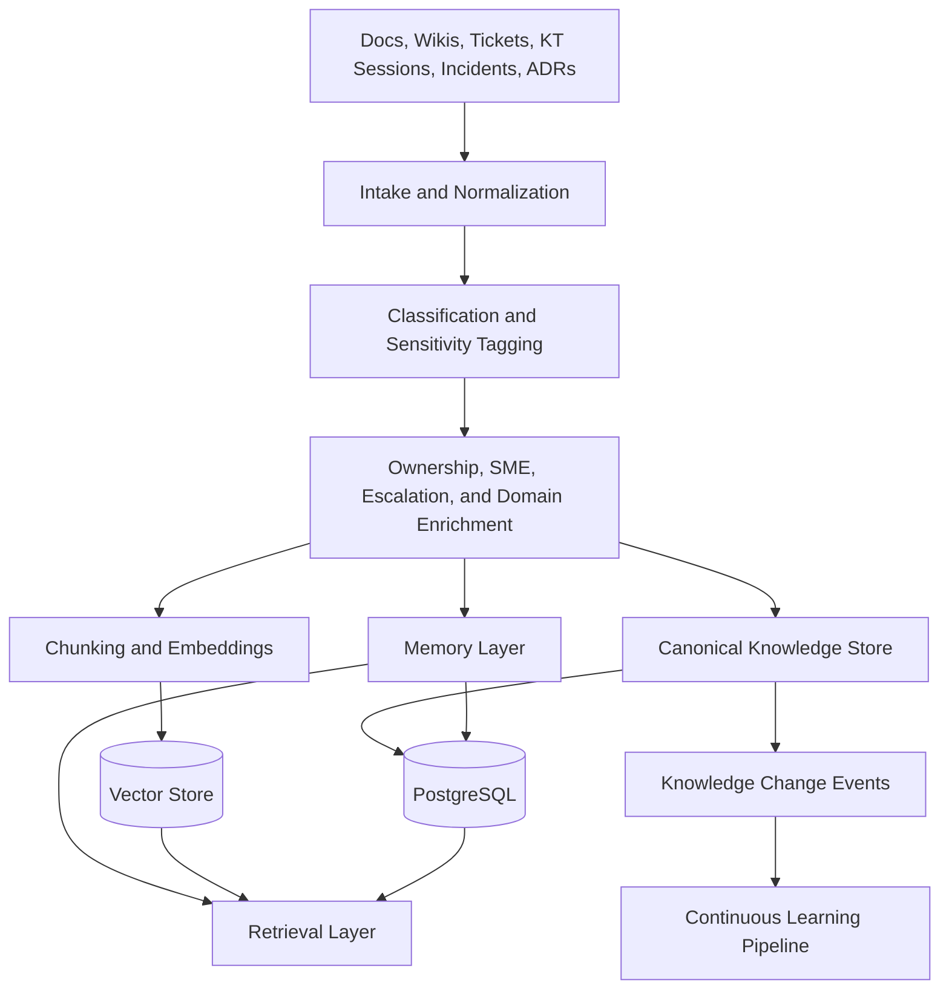

# Knowledge Management

## Objective

OIP treats enterprise knowledge as a managed asset rather than a loose collection of files. The knowledge architecture must support both retrieval quality and operational accountability.

Within OIP, the Memory Layer is the long-term system that preserves and organizes that knowledge over time. Knowledge management governs the content domain; memory management ensures that durable lessons, decisions, relationships, and history remain accessible even as models, prompts, and teams change.

## Knowledge Domains

OIP supports the following first-class knowledge types:

- Documents: specifications, manuals, policies, proposals, and project artifacts
- KT Sessions: handovers, onboarding sessions, and recorded knowledge transfers
- Architecture Decisions: design choices, tradeoffs, constraints, and consequences
- Runbooks: operational procedures and response steps
- Incidents: production issues, timelines, root causes, and corrective actions
- SMEs: people associated with specific systems or domains
- Ownership: accountable teams, services, and business owners
- Escalations: support paths, severity handling, and dependency contacts

These types should share a common metadata model while preserving type-specific attributes.

## Design Approach

### Unified Knowledge Record

Every knowledge asset is stored as a managed record with:

- Source metadata
- Business metadata
- Security classification
- Ownership and stewardship
- Lifecycle state
- Retrieval metadata
- Linkage to related entities

This design ensures knowledge is not only searchable but governable.

### Human and System Context

Enterprise knowledge is incomplete without people and accountability. OIP therefore models SMEs, ownership, and escalation paths alongside content. This is crucial because good answers often require both documents and responsible contacts.

### Temporal Relevance

Knowledge records must carry effective dates, last review dates, and freshness signals. Retrieval quality degrades quickly when stale procedures or superseded decisions remain indistinguishable from current truth.

## Ingestion Process

1. Acquire content from uploads, repositories, tickets, wikis, recordings, or external connectors.
2. Normalize the raw source into canonical text, metadata, and attachments.
3. Classify the artifact by type, sensitivity, and domain.
4. Enrich the record with ownership, SME, escalation, and system associations.
5. Chunk and embed the content for retrieval.
6. Persist both the canonical record and retrieval artifacts.
7. Run quality checks for duplicates, staleness, and metadata gaps.
8. Publish change events so downstream learning and agent workflows can react.

These ingestion flows should also emit memory candidates into the Memory Layer so project history, engineering lessons, and organizational procedures become reusable long-term memory instead of isolated documents.

## Knowledge Flow

## Why This Matters

- Retrieval alone is not enough for enterprise use; ownership and escalation make answers actionable.
- Canonical records and retrieval artifacts must be stored separately so indexing strategy can evolve without corrupting source truth.
- Knowledge change events make the platform extensible for Delivery Wizard, PortalOps AI, EventEase, and WorkTime, all of which can subscribe to shared organizational intelligence.
