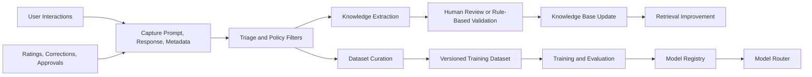

# Learning Pipeline

## Objective

OIP continuously improves the usefulness of its knowledge and AI behavior by capturing interactions, extracting reusable insights, and producing curated datasets where appropriate.

## Core Capabilities

- Interaction capture
- Feedback capture
- Knowledge extraction
- Dataset generation
- Fine-tuning preparation

## Knowledge Learning vs Model Training

### Knowledge Learning

Knowledge learning improves what the system knows by updating the searchable knowledge base. It answers questions better by improving retrieval inputs.

Examples:

- Extracting a new troubleshooting step from an incident resolution
- Recording a new architecture decision
- Linking a KT session to the responsible SME

### Model Training

Model training improves how a model behaves by changing model weights or fine-tune parameters. It answers questions better by adapting generation behavior itself.

Examples:

- Training a coding assistant to follow a house style
- Improving structured output reliability
- Specializing a model for a domain-specific classification task

### Why They Are Different

- Knowledge learning is lower risk, faster to apply, and often enough for factual improvement.
- Model training is slower, more expensive, and requires stronger governance.
- Mixing them leads teams to fine-tune when retrieval or metadata fixes would solve the problem more safely.

OIP therefore keeps these as separate but connected pipelines.

## Learning Workflow

## Design Notes

### Interaction Capture

Capture should include prompt, response, selected model, token usage, citations, tools used, and workspace context. This produces both operational telemetry and learning material.

### Feedback Capture

Feedback must support explicit ratings, corrections, approvals, and issue categorization. Binary thumbs-up signals alone are too weak for enterprise learning.

### Knowledge Extraction

Extraction should identify reusable facts, procedures, ownership mappings, incident lessons, and architecture decisions. Extracted knowledge should be reviewed before broad publication when confidence is low.

### Dataset Generation

Datasets should be versioned, attributed, policy-checked, and traceable back to approved sources. This preserves trust and enables rollback if low-quality data slips in.

## Why This Architecture Scales

- It allows organizations to improve quickly through retrieval before taking on the complexity of fine-tuning.
- It supports human oversight for high-impact learning paths.
- It creates a reusable learning substrate for future applications built on OIP.
