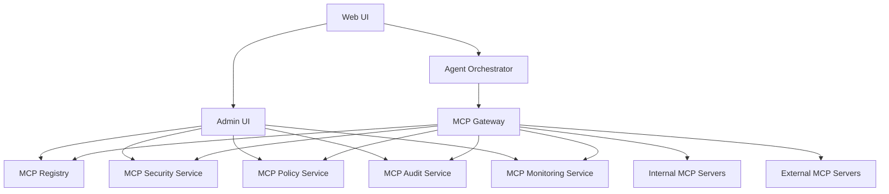
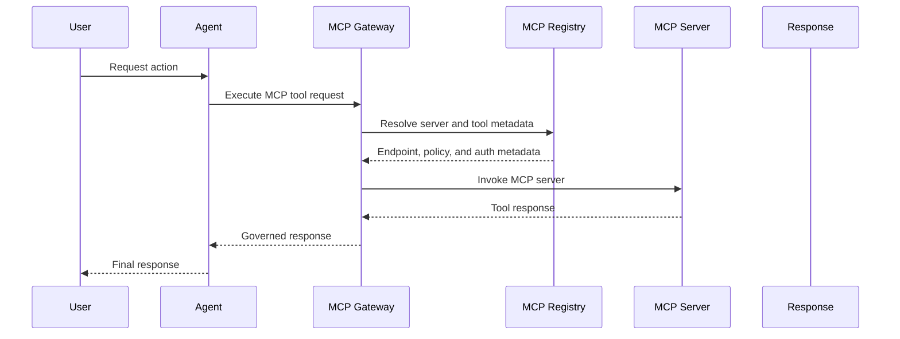
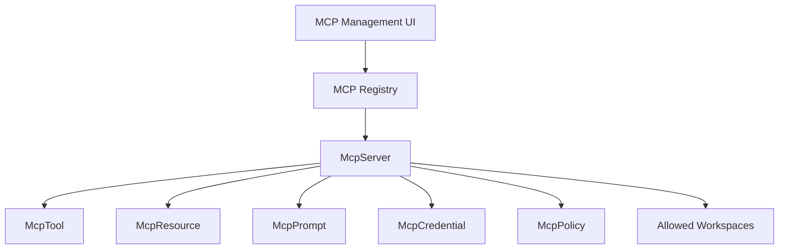
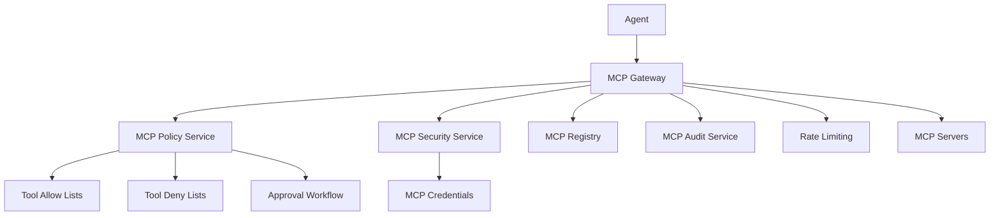
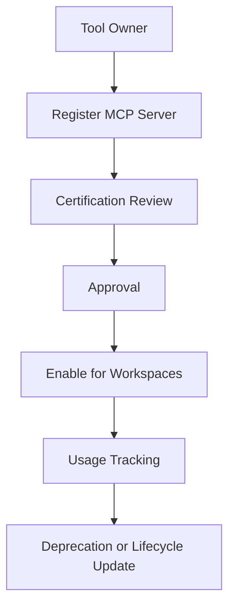
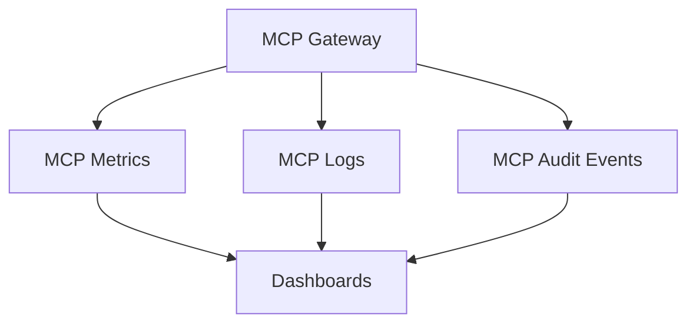
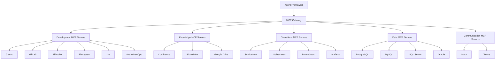
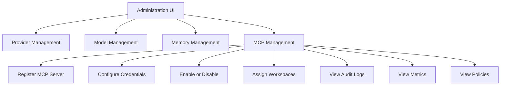
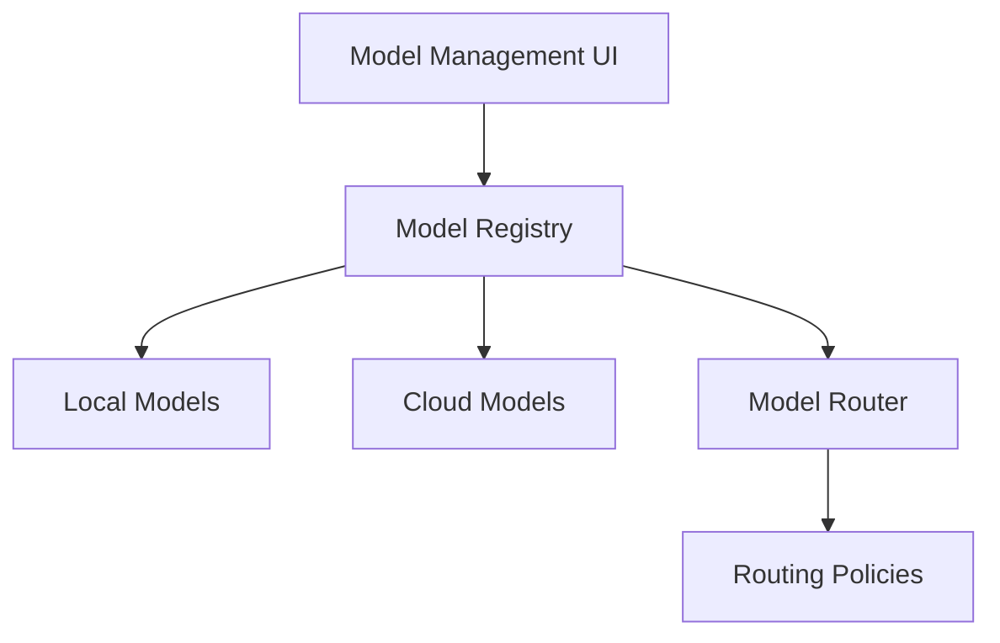

# MCP Architecture

Open Intelligence Platform treats MCP as a first-class platform capability. MCP is not a plugin model. It is the governed integration backbone that allows models, agents, and future OIP products to interact with tools, enterprise systems, repositories, databases, APIs, and internal platform services.

OIP is a Private AI Development Platform with Memory.

Private First. Cloud Optional. Vendor Neutral.

## MCP Design Principles

- MCP is a platform capability, not a plugin
- All agents should access tools through the MCP layer
- MCP integrations must be governed, audited, and secured
- MCP servers must be discoverable and manageable through OIP
- Tool access must be controlled by policies
- OIP must support both internal and external MCP servers
- Future OIP products must reuse the same MCP infrastructure
- MCP is model-independent infrastructure

## MCP Platform Services

- `MCP Gateway`
- `MCP Registry`
- `MCP Security Service`
- `MCP Policy Service`
- `MCP Audit Service`
- `MCP Monitoring Service`

## Model Independence

The MCP layer is independent of the selected model.

Whether OIP uses:

- `Qwen`
- `DeepSeek`
- `Llama`
- `GPT`
- `Claude`

the MCP layer remains unchanged. Tool integration, policy enforcement, audit, and monitoring should not depend on which model generated the tool request.

## MCP Service Topology

## MCP Logical Flow

## MCP Domain Model

Core MCP entities in OIP are:

- `McpServer`
- `McpTool`
- `McpResource`
- `McpPrompt`
- `McpPolicy`
- `McpConnection`
- `McpAuditEvent`
- `McpCredential`

## MCP Registry

The MCP registry stores discoverable metadata for servers and tools.

### Required Registry Fields

- Name
- Description
- Owner
- Version
- Endpoint
- Authentication Type
- Status
- Capabilities
- Allowed Workspaces

### Registry Model

## MCP Security

The MCP security model must support:

- Authentication
- Authorization
- Tool permissions
- Workspace isolation
- Tool allow lists
- Tool deny lists
- Audit trails
- Approval workflows
- Rate limiting

### Trust Boundaries

- Agent to MCP Gateway
- MCP Gateway to MCP Registry
- MCP Gateway to internal MCP servers
- MCP Gateway to external MCP servers
- MCP Gateway to credential stores
- Workspace boundary between tool access scopes

### Security Model

## MCP Governance

The MCP governance model supports:

- Tool ownership
- Tool certification
- Tool approval
- Tool lifecycle management
- Tool deprecation
- Tool usage tracking

Governance ensures MCP servers are not treated as unmanaged integrations. Each server and tool should have an owner, certification state, allowed workspace set, and lifecycle status.

MCP ownership remains with the organization. Users retain control of MCP integrations, credentials, policies, and workflows rather than embedding those dependencies inside any single provider or assistant.

## MCP Observability

MCP observability should track:

- Tool executions
- Tool latency
- Tool failures
- Tool costs
- Tool success rates
- Agent tool usage

## Enterprise MCP Integrations

OIP should support MCP-based integration patterns for:

### Development

- GitHub
- GitLab
- Bitbucket
- Filesystem
- Jira
- Azure DevOps

### Knowledge

- Confluence
- SharePoint
- Google Drive

### Operations

- ServiceNow
- Kubernetes
- Prometheus
- Grafana

### Data

- PostgreSQL
- MySQL
- SQL Server
- Oracle

### Communication

- Slack
- Teams

## MCP Management UI

The frontend should expose administration screens for:

- Provider Management
- Model Management
- Memory Management
- MCP Management

MCP Management must support:

- Register MCP Server
- Configure Credentials
- Enable or Disable
- Assign Workspaces
- View Audit Logs
- View Metrics
- View Policies

## Model Management

All models should be managed through the UI. No code changes should be required when adding models.

The Model Registry stores:

- Model Name
- Provider
- Version
- Context Window
- Capabilities
- Cost Information
- Routing Priority
- Status

Supported model sources include:

### Local Models

- Ollama
- vLLM

### Cloud Models

- OpenAI
- Anthropic
- Gemini
- DeepSeek
- OpenRouter

## Routing Policies

Routing policies should be configurable from the frontend.

Examples:

- Coding -> Qwen Coder
- Architecture -> GPT
- Documentation -> Claude
- Fallback -> DeepSeek

The model router should consume policy definitions and model registry metadata rather than hard-coded mappings.

## MVP and Phase Guidance

MCP is not required for the MVP.

The MVP remains focused on:

- Memory Layer
- RAG
- Provider Routing
- Local and Cloud Models

MCP becomes a Phase 4.5 capability. The current architecture should preserve extension points and registry patterns so MCP can be added without redesigning existing services.
