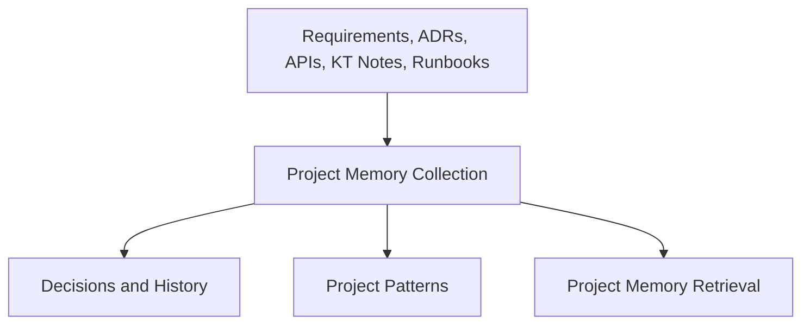
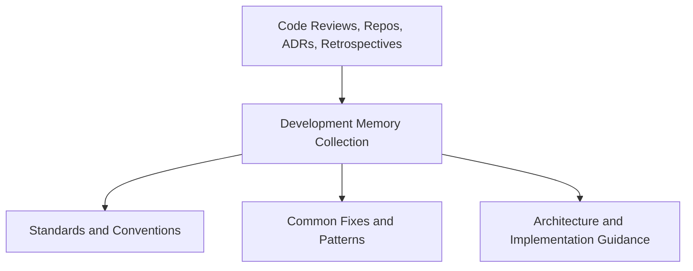
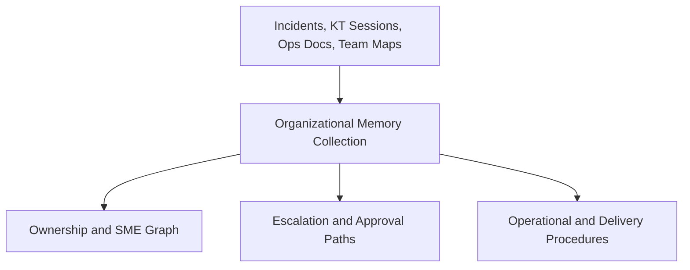
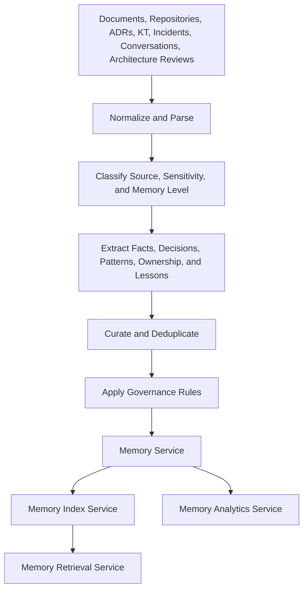
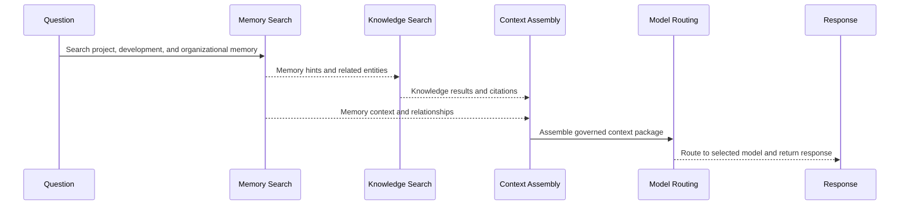
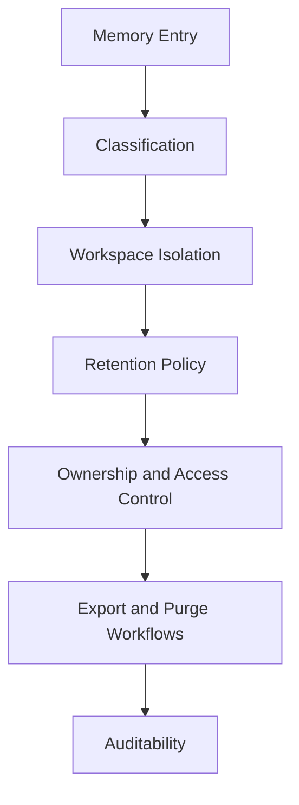

# Memory Layer

Open Intelligence Platform includes a first-class Memory Layer because the platform is not only an AI platform. It is a private AI development platform with organizational memory.

The Memory Layer is the long-term knowledge system of OIP. Models may change over time, but organizational knowledge, engineering decisions, project history, and lessons learned remain preserved and continuously accessible.

## Memory Principles

- Memory is separate from model weights
- Knowledge grows continuously
- Models may change
- Memory persists
- Memory can be shared or isolated

Memory and model training are different concerns.

Memory preserves externalized knowledge in durable records, relationships, metadata, and retrieval indexes. It can be governed, shared, audited, exported, purged, and updated continuously.

Model training changes model behavior by altering weights or adapters. Training can improve style, task specialization, or domain behavior, but it is slower, riskier, harder to audit, and less precise for preserving factual or organizational knowledge.

OIP treats memory as the long-lived system of record for accumulated knowledge, while model training is an optional optimization path.

## Memory Levels

### Level 1: Project Memory

Purpose:

Preserve project-specific knowledge.

Examples:

- Requirements
- Architecture
- OpenAPI contracts
- ADRs
- Design decisions
- KT notes
- Runbooks
- Troubleshooting guides

Projects may include:

- EventEase
- WorkTime
- MQSOM
- Delivery Wizard
- PortalOps AI

### Level 2: Development Memory

Purpose:

Capture engineering patterns and lessons learned.

Examples:

- Preferred architectures
- Coding standards
- Technology decisions
- Common fixes
- Reusable implementation patterns
- OpenAPI conventions
- Spring Boot conventions
- Flutter conventions

### Level 3: Organizational Memory

Purpose:

Preserve how an organization operates.

Examples:

- SMEs
- Ownership
- Escalation paths
- Team responsibilities
- Approval workflows
- Delivery processes
- Operational procedures

## Memory Services

The Memory Layer introduces five platform services:

- `Memory Service`
- `Memory Index Service`
- `Memory Retrieval Service`
- `Memory Governance Service`
- `Memory Analytics Service`

### Memory Service

Stores canonical memory records, collections, relationships, and snapshots.

### Memory Index Service

Builds searchable indexes, embeddings, and relationship-aware lookup structures over memory entries.

### Memory Retrieval Service

Searches project, development, and organizational memory before or alongside traditional knowledge retrieval.

### Memory Governance Service

Applies workspace isolation, retention, classification, export, purge, ownership, and audit policies to memory.

### Memory Analytics Service

Measures knowledge quality, freshness, duplication, and coverage gaps to improve the memory system over time.

## Memory Ingestion

OIP should ingest memory from:

- Documents
- Source code repositories
- ADRs
- KT sessions
- Incident reports
- User conversations
- Architecture reviews

## Memory Retrieval

The retrieval workflow should combine memory with traditional knowledge retrieval.

## Memory Governance

The Memory Layer must support:

- Workspace isolation
- Retention policies
- Data classification
- Export
- Purge
- Ownership
- Auditability

## Delivery Wizard Alignment

The Memory Layer is designed as a reusable platform capability, not a product-specific add-on. Future products such as Delivery Wizard, PortalOps AI, EventEase AI, and WorkTime AI should consume the same memory services, governance model, and retrieval flows through shared APIs and policies.

This allows OIP to serve as a common memory substrate across products without architectural redesign.
