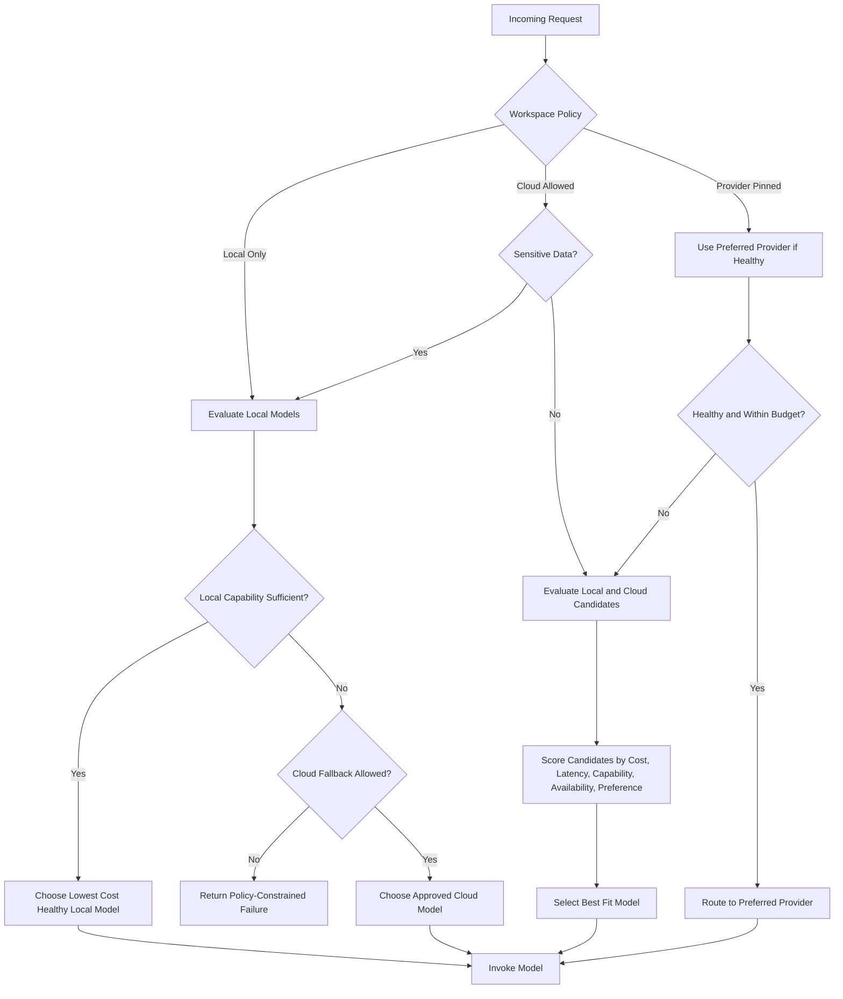
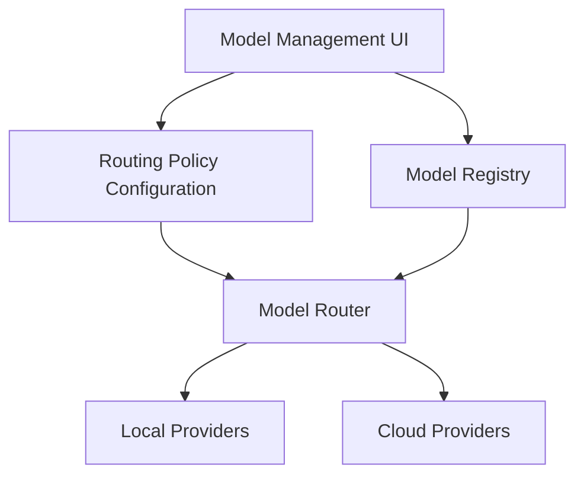

# Model Routing

## Objective

OIP routes each request to the most appropriate model based on policy and runtime conditions. The routing layer is the primary mechanism for balancing privacy, cost, capability, latency, and resilience.

## Supported Providers

### Local

- `Ollama`
- `vLLM`

### Cloud

- `OpenAI`
- `Anthropic`
- `Google Gemini`
- `OpenRouter`
- `DeepSeek`

## Routing Criteria

### Cost

Requests should default to the least expensive model that can satisfy the task. This is essential for sustained organizational usage.

### Latency

Interactive use cases such as coding assistance and chat should prefer faster response profiles when capability tradeoffs are acceptable.

### Capability

Complex reasoning, large context windows, multimodal inputs, or code generation quality may require higher-tier models.

### Availability

The router must degrade gracefully when a provider is down, rate-limited, or unhealthy.

### User Preference

Users or workspaces may express policies such as local-only, cloud-allowed, premium-on-demand, or specific provider preference.

## Routing Policy Model

The router should evaluate:

- Workspace policy
- User preference
- Request type and required capability
- Sensitivity classification
- Provider health
- Current pricing and token budget
- Latency SLO
- Availability of local hardware
- UI-configured routing policy rules
- Model registry metadata such as routing priority and status

## Decision Flow

## Why Dedicated Routing Exists

- It prevents provider logic from spreading across applications and agents.
- It enables centralized budget, policy, and resilience controls.
- It gives future products a shared intelligence fabric instead of embedding model decisions in each codebase.

## Extensibility

Future integrations such as Delivery Wizard, PortalOps AI, EventEase AI, and WorkTime AI should call the same routing service or SDK. That keeps model governance consistent across products while still allowing domain-specific prompting and tools.

## UI-Configurable Routing Policies

Routing policies should be configurable through the frontend rather than hard-coded. OIP should allow administrators to map task categories to preferred models and fallback models using model registry entries.

Examples:

- Coding -> Qwen Coder
- Architecture -> GPT
- Documentation -> Claude
- Fallback -> DeepSeek

These rules should be stored as managed policy data so model selection can evolve without code changes.

## Model Registry Expectations

The model registry should store:

- Model name
- Provider
- Version
- Context window
- Capabilities
- Cost information
- Routing priority
- Status

This gives the model router enough metadata to make governed, configurable decisions across local and cloud providers.

