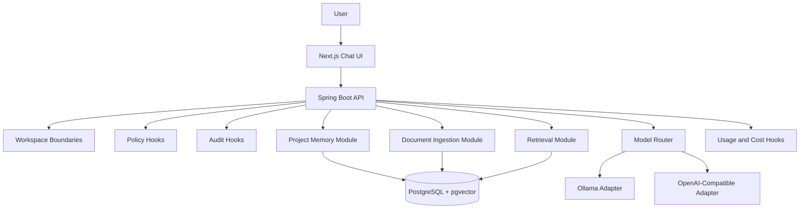
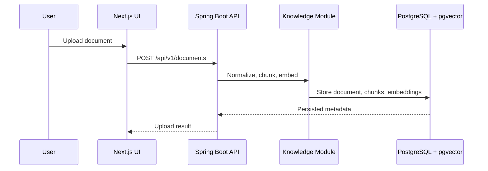
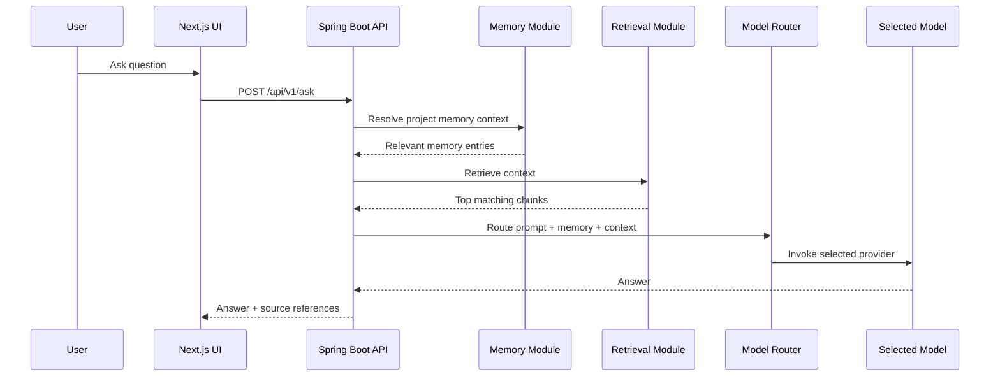

# MVP

## Objective

The first runnable MVP of Open Intelligence Platform proves one complete, useful flow:

1. Ingest private documents
2. Chunk and embed them into `PostgreSQL` with `pgvector`
3. Ask a question through a simple chat UI
4. Retrieve relevant context
5. Route the request to a local or cloud model
6. Return a grounded answer

The MVP is intentionally small. It is not a reduced copy of the full target architecture. It is a deliberate implementation slice that validates the most important technical seams.

The MVP is intentionally small, but every MVP component is designed as the first version of a production-grade enterprise capability.

## MVP Scope

### Included

- `Spring Boot` backend as a modular monolith
- `Next.js` frontend
- `PostgreSQL` with `pgvector`
- Local inference provider for `Ollama`
- One OpenAI-compatible provider
- Basic model router
- Document ingestion
- Chunking
- Embedding generation
- Vector retrieval
- Initial project memory collections
- Source attribution for project memory artifacts
- Ask-question API
- Simple chat UI
- Foundational observability hooks for request tracing, token usage, and cost reporting
- Internal boundaries that can grow into identity, policy, audit, registry, and governance services

### Out of Scope

- Large microservice decomposition
- Multi-agent orchestration
- Fine-tuning pipelines
- Kafka-based event backbone
- Enterprise SSO, SCIM, or advanced RBAC
- Multi-tenant billing and quotas
- Complex workflow automation
- Organizational intelligence features such as SME mapping, escalations, and incident graphing
- Full HA, DR, and multi-environment production automation

## Why This MVP

This MVP focuses on the minimum path that proves OIP is viable:

- Provider abstraction works
- Local-first AI works
- Retrieval improves answer quality
- The backend can support clean modular growth
- The frontend can offer a usable experience without waiting for the entire platform
- Enterprise direction is preserved without forcing enterprise complexity into day one setup

## MVP Architecture



## Backend Design

The backend should be a modular monolith rather than a microservice set. This gives the project one deployable unit with clean internal boundaries and much lower operational complexity.

Recommended internal modules:

- `api`: REST controllers and request models
- `knowledge`: document ingestion, chunking, embedding, and retrieval
- `routing`: model selection and normalized inference contracts
- `providers`: `Ollama` and OpenAI-compatible provider integrations
- `persistence`: repositories, migrations, and vector queries
- `shared`: configuration, error handling, and observability hooks

These modules should be coded as the first version of broader enterprise capabilities. For example, `routing` should anticipate policy and fallback logic, and `persistence` should leave room for audit, registry, and workspace metadata.

## Frontend Design

The frontend should begin with a minimal but real product surface:

- Chat page
- Document upload page or upload panel
- Model preference selector
- Response area with citations or source hints

The frontend should not attempt to model all future workspace, admin, or agent experiences yet.

## Primary API Flows

### Document Ingestion



### Ask Question



## Initial Data Model

The MVP data model should stay small:

- `documents`
- `chunks`
- `embeddings`
- `memory_collections`
- `memory_entries`
- `memory_sources`
- `conversations`
- `messages`
- `provider_configs`
- `workspace_configs`
- `usage_events`

This is enough to support ingestion, retrieval, and chat without prematurely encoding the entire long-term domain model into the first implementation.

## Suggested Repository Growth

The implementation should start with a simple structure aligned to the modular monolith:

```text
frontend/
  apps/
    web/
backend/
  oip-server/
docs/
  adr/
```

If the MVP succeeds, later milestones can extract modules or split services based on real pressure rather than anticipation.

## Definition of Done

The MVP is successful when a contributor can:

1. Start PostgreSQL with `pgvector`
2. Start the Spring Boot backend
3. Start the Next.js frontend
4. Upload one or more documents
5. Ask a question grounded in those documents
6. Receive an answer produced through the model router using either `Ollama` or the OpenAI-compatible provider

## Enterprise Direction

The MVP should remain easy to build and run, but its implementation should not dead-end the platform. The MVP should prepare for later addition of:

- SSO and enterprise identity
- RBAC, ABAC, and policy enforcement
- Provider, model, and prompt registries
- Cost governance and quotas
- Audit logging and response review
- HA deployment and Kubernetes operations

## Relationship to the Full Architecture

The MVP does not replace the architecture package. It operationalizes the first slice of it. Future phases can add agents, continuous learning, organizational intelligence, and fine-tuning on top of this foundation without discarding the MVP's core abstractions.
