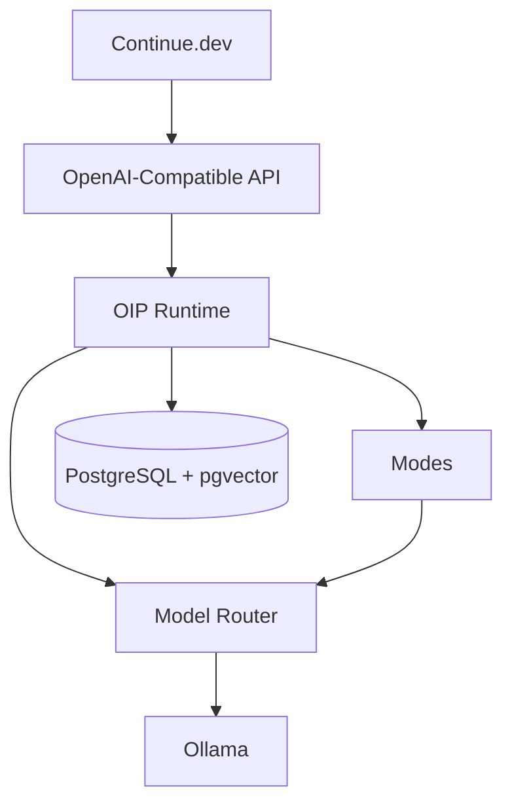
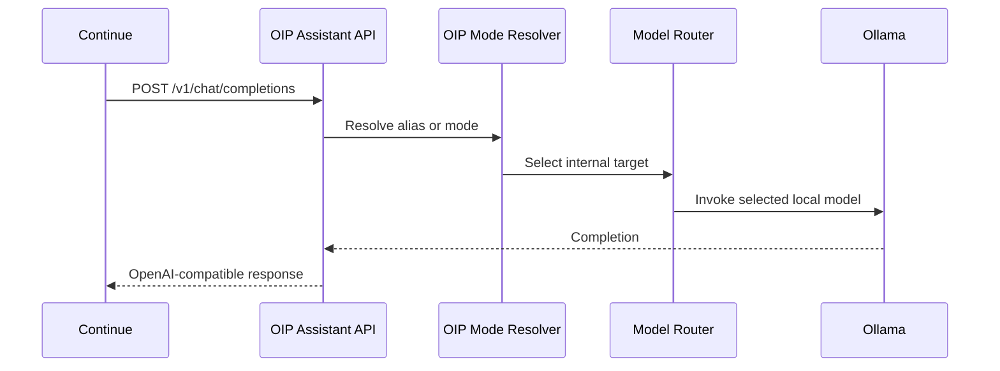
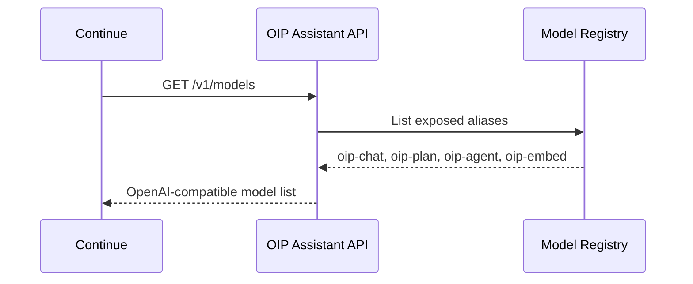

# MVP

## Objective

The first runnable MVP of Open Intelligence Platform proves one complete, useful assistant-runtime flow:

1. `Continue` calls OIP using an OpenAI-compatible API
2. OIP resolves an internal assistant mode or model alias
3. OIP routes the request to a local model through `Ollama`
4. OIP returns an OpenAI-compatible response to the client

The MVP is intentionally small. It is not a reduced copy of the full target architecture. It is a deliberate implementation slice that validates the most important technical seams.

The MVP is intentionally small, but every MVP component is designed as the first version of a production-grade enterprise capability.

## MVP Scope

### Included

- `Spring Boot` backend as a modular monolith
- OpenAI-compatible assistant API
- `PostgreSQL` with `pgvector`
- Local inference provider for `Ollama`
- Basic model router
- Assistant-facing model discovery
- Assistant-facing chat completions
- OIP model aliases
- Initial OIP runtime modes: `CHAT`, `PLAN`, `AGENT`
- Swagger UI and published OpenAPI contract
- Foundational observability hooks for request tracing, token usage, and cost reporting
- Internal boundaries that can grow into identity, policy, audit, registry, and governance services

### Out of Scope

- Full administration dashboard implementation
- Memory ingestion and retrieval as MVP blockers
- Knowledge ingestion and retrieval as MVP blockers
- Large microservice decomposition
- Multi-agent orchestration
- Fine-tuning pipelines
- Kafka-based event backbone
- Enterprise SSO, SCIM, or advanced RBAC
- Multi-tenant billing and quotas
- Complex workflow automation
- Full HA, DR, and multi-environment production automation

## Why This MVP

This MVP focuses on the minimum path that proves OIP is viable:

- Assistant compatibility works
- Local-first AI works
- Provider abstraction works
- OIP can sit between assistant clients and raw providers
- OIP can hide raw provider model names behind stable aliases
- OIP can establish mode-based behavior before complex agent orchestration
- The backend can support clean modular growth
- Administration UI can be added later without redesigning the runtime
- Enterprise direction is preserved without forcing enterprise complexity into the first milestone

## MVP Architecture



## Backend Design

The backend should be a modular monolith rather than a microservice set. This gives the project one deployable unit with clean internal boundaries and much lower operational complexity.

Recommended internal modules:

- `api`: REST controllers and request models
- `modes`: runtime mode resolution and prompt mapping
- `routing`: model selection and normalized inference contracts
- `providers`: `Ollama` integration and internal provider abstraction
- `registry`: model aliases and provider metadata
- `persistence`: repositories, migrations, and vector queries
- `shared`: configuration, error handling, and observability hooks

These modules should be coded as the first version of broader enterprise capabilities. For example, `routing` should anticipate policy and fallback logic, `registry` should anticipate admin-managed aliases, and `persistence` should leave room for audit, registry, and workspace metadata.

## Model Abstraction

Assistant clients should not see raw provider model names. They should see OIP-managed aliases.

Initial aliases:

- `oip-chat`
- `oip-plan`
- `oip-agent`
- `oip-embed`

Example internal routing:

- `oip-chat -> llama3`
- `oip-plan -> llama3`
- `oip-agent -> qwen2.5-coder`
- `oip-embed -> nomic-embed-text`

## Primary API Flows

### Assistant Chat Flow



### Assistant Model Discovery



## OpenAPI Contract

OIP must publish an OpenAPI specification at:

```text
openapi/oip-api.yaml
```

Initial contract scope:

- `GET /v1/models`
- `POST /v1/chat/completions`
- `POST /v1/embeddings`

Future:

- `POST /v1/responses`

Swagger UI must remain enabled.

## Definition of Done

The MVP is successful when a contributor can:

1. Start PostgreSQL with `pgvector`
2. Start the Spring Boot backend
3. Configure `Continue` with:
   `provider: openai`
   `apiBase: http://localhost:8080/v1`
4. Call `GET /v1/models`
5. Call `POST /v1/chat/completions`
6. Receive an OpenAI-compatible response routed through OIP to `Ollama`
7. Use OIP aliases rather than raw provider model names

## Enterprise Direction

The MVP should remain easy to build and run, but its implementation should not dead-end the platform. It should prepare for:

- an administration UI
- provider, model, and prompt registries
- memory and knowledge expansion
- cost governance and quotas
- audit logging and response review
- SSO and enterprise identity
- HA deployment and Kubernetes operations

## Relationship to the Full Architecture

This MVP does not replace the broader OIP architecture. It validates the first assistant-facing surface of it.

The next major architectural step after runtime modes is the administration UI, which will manage:

- models
- providers
- memory
- knowledge
- tools
- monitoring
- settings
