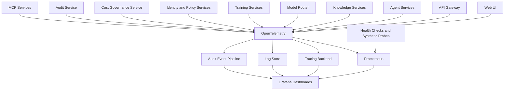

# Observability

## Objective

OIP needs deep observability because AI systems fail in ways that are more complex than traditional CRUD applications. The platform must expose model latency, token usage, retrieval quality indicators, agent execution paths, and infrastructure health.

Observability must support all three operating tiers, from a developer debugging local retrieval quality to an enterprise platform team governing production cost, safety, and service health.

## Observability Architecture

## Application Logs

Logs should be structured and correlated with request IDs, workspace IDs, agent execution IDs, and model invocation IDs. Sensitive payload logging must be controlled by policy and redaction.

Key log categories:

- Authentication and authorization
- API access and failures
- Retrieval pipeline activity
- Model invocation metadata
- Agent tool execution
- Training lifecycle events
- MCP server registration and lifecycle events
- MCP tool execution events
- Environment promotion and deployment events
- Backup, restore, and DR activity

## AI Request Logs

AI-specific logs should capture:

- Prompt template or prompt version identifier
- Provider and model used
- Workspace and user context
- Safety policy outcome
- Retrieval document and chunk references
- Human approval or review status where required

Logs should store metadata by default and only store prompt or response bodies when policy allows it.

## Metrics

Recommended metric families:

- Request volume, latency, and error rate
- Token usage and estimated cost
- Provider cost tracking
- Workspace cost attribution
- Retrieval latency and hit quality proxies
- Model latency and fallback frequency
- Rate limiting and quota enforcement
- Model quality metrics and evaluation results
- Provider health and fallback frequency
- MCP tool latency and failure rate
- MCP tool success rate
- Agent MCP tool usage counts
- Queue depth and worker throughput
- Training job duration and failure rates
- Audit event volume and policy denial counts

## Prompt and Response Metadata

Prompt and response telemetry should include:

- Prompt registry identifier or ad hoc prompt flag
- Model registry version
- Response size and streaming duration
- Citation count and retrieval confidence indicators
- Reviewer disposition for approved or rejected responses

## Retrieval Metrics

Retrieval observability should track:

- Embedding generation duration
- Vector search latency
- Reranking latency
- Context assembly size
- Source attribution coverage
- Missed retrieval or low-confidence response rate

## Model Quality Metrics

Quality metrics should include:

- Evaluation dataset scores
- Prompt regression results
- Response review acceptance rate
- Safety policy violation rate
- Hallucination or unsupported-answer proxies where available

These metrics support enterprise release gates and safe model promotion.

## Tracing

Distributed tracing should follow:

- UI request to API gateway
- Identity and policy checks
- Gateway to knowledge retrieval
- Retrieval to vector store
- Gateway or agent to model router
- Router to provider integration
- Router fallback and cost policy decisions
- Agent workflow steps and tool calls
- Audit and review events where applicable
- MCP registry lookup and tool execution traces

Tracing is especially valuable for diagnosing slow or expensive prompts.

## Health Monitoring

Health monitoring should include:

- Liveness and readiness probes
- Dependency checks for database, vector store, Kafka, and model providers
- Synthetic prompts for canary validation
- Alerting on provider degradation, excessive fallback, and training worker failures
- Alerting on MCP server failures, elevated latency, and tool denial spikes
- Readiness checks before rolling or blue-green promotion
- Backup job and restore validation status

## Audit Events

Audit events should be observable alongside application telemetry so operators can correlate:

- Policy denials with user requests
- Prompt changes with quality regressions
- Provider changes with cost shifts
- Release promotions with operational incidents
- MCP policy changes with tool execution failures

## Why This Design

- `OpenTelemetry` provides vendor-neutral instrumentation, which matches OIP's anti-lock-in goals.
- `Prometheus` and `Grafana` are widely adopted, open, and operationally proven.
- AI-specific observability requires correlation across retrieval, routing, generation, governance, and cost, which this architecture supports directly.
