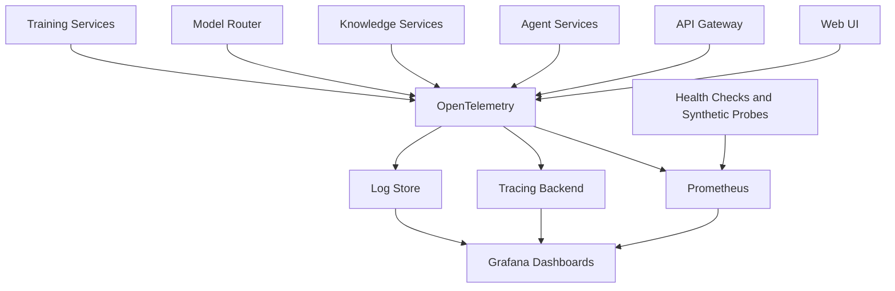

# Observability

## Objective

OIP needs deep observability because AI systems fail in ways that are more complex than traditional CRUD applications. The platform must expose model latency, token usage, retrieval quality indicators, agent execution paths, and infrastructure health.

## Observability Architecture

## Logging

Logs should be structured and correlated with request IDs, workspace IDs, agent execution IDs, and model invocation IDs. Sensitive payload logging must be controlled by policy and redaction.

Key log categories:

- Authentication and authorization
- API access and failures
- Retrieval pipeline activity
- Model invocation metadata
- Agent tool execution
- Training lifecycle events

## Metrics

Recommended metric families:

- Request volume, latency, and error rate
- Retrieval latency and hit quality proxies
- Model token usage and estimated cost
- Provider health and fallback frequency
- Queue depth and worker throughput
- Training job duration and failure rates

## Tracing

Distributed tracing should follow:

- UI request to API gateway
- Gateway to knowledge retrieval
- Retrieval to vector store
- Gateway or agent to model router
- Router to provider adapter
- Agent workflow steps and tool calls

Tracing is especially valuable for diagnosing slow or expensive prompts.

## Health Monitoring

Health monitoring should include:

- Liveness and readiness probes
- Dependency checks for database, vector store, Kafka, and model providers
- Synthetic prompts for canary validation
- Alerting on provider degradation, excessive fallback, and training worker failures

## Why This Design

- `OpenTelemetry` provides vendor-neutral instrumentation, which matches OIP's anti-lock-in goals.
- `Prometheus` and `Grafana` are widely adopted, open, and operationally proven.
- AI-specific observability requires correlation across retrieval, routing, and generation, which this architecture supports directly.
