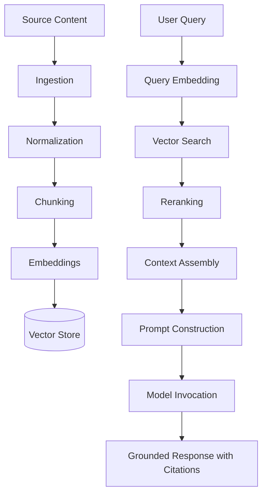

# RAG Architecture

## Objective

Retrieval-augmented generation gives OIP grounded answers over private knowledge while reducing hallucination and avoiding unnecessary fine-tuning.

## Retrieval Flow

## Pipeline Stages

### Ingestion

The system ingests documents, tickets, notes, recordings, architecture decisions, runbooks, and incidents from supported sources.

### Chunking

Chunking should preserve semantic coherence rather than using fixed token windows only. Strategies vary by content type:

- Documents: heading-aware chunks
- Runbooks: step-aware chunks
- Incidents: timeline-aware chunks
- KT sessions: topic-aware chunks

### Embeddings

Embeddings are generated per chunk and stored with document lineage, timestamps, and sensitivity metadata. This supports filtering, freshness scoring, and re-indexing.

### Vector Search

The retrieval layer performs semantic search with metadata filters such as workspace, document type, access classification, and recency.

### Reranking

Reranking improves precision by evaluating candidate passages against the query intent, reducing irrelevant context.

### Context Assembly

The system assembles the highest-value set of passages under token limits while preserving source diversity and citation traceability.

## Architectural Decisions

- Retrieval is separated from generation so either side can evolve independently.
- Metadata-aware filtering is mandatory for enterprise relevance and security.
- Reranking is included because naive vector similarity is often insufficient for high-quality responses.
- Context assembly tracks lineage so responses can cite authoritative sources and support audit needs.
