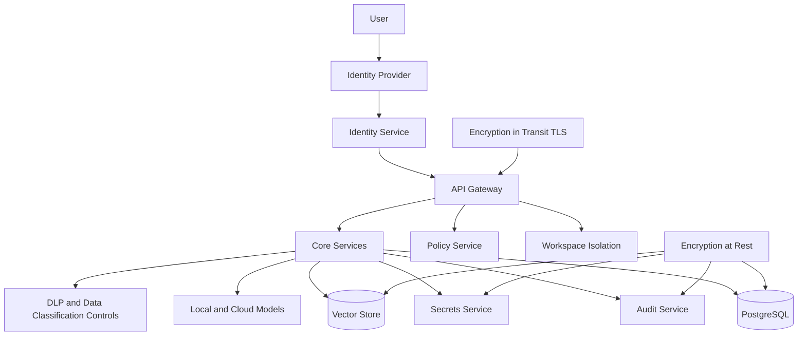

# Security

## Security Goals

OIP must protect user data, private knowledge, model credentials, and operational control planes while still supporting local-first and hybrid deployments.

Security must work across three deployment tiers:

- Developer or solo deployment
- Team or small business deployment
- Enterprise or production deployment

The security architecture should scale from a simple self-hosted install to enterprise-grade identity, policy, DLP, and audit controls.

## Security Architecture

## Threat Model

OIP should assume threats from:

- Stolen user or service credentials
- Unauthorized workspace access
- Prompt leakage through logs or telemetry
- Misconfigured provider keys
- Unsafe connector ingestion
- Model output containing sensitive data
- Lateral movement between workspaces or environments
- Insecure local model hosting on shared infrastructure
- Destructive or unauthorized administrative changes

## Trust Boundaries

Key trust boundaries include:

- Browser or client to API gateway
- API gateway to internal services
- Platform services to databases and vector stores
- OIP to cloud model providers
- OIP to local model runtimes
- OIP to external connectors such as GitHub, SharePoint, Jira, and ServiceNow
- Environment boundaries between development, test, staging, and production
- Workspace boundaries between tenants, teams, or client contexts

Every boundary should have explicit identity, transport security, logging, and policy enforcement expectations.

## Identity Architecture

Authentication should support:

- Local username and password for self-hosted simplicity
- OIDC or SAML federation for enterprise integration
- LDAP or Active Directory integration where enterprise directories remain authoritative
- Service accounts for automation and trusted workloads
- Short-lived tokens for API access
- Federated identities from enterprise identity providers

Central identity makes future product integration much easier because Delivery Wizard, PortalOps AI, EventEase, and WorkTime can rely on the same identity foundation.

## Authorization

Authorization should be enforced at multiple layers:

- API scope and endpoint access
- Workspace membership
- Knowledge base access classification
- Tool and agent capability permissions
- Administrative policy changes
- Prompt, model, and provider usage permissions
- Response review and approval gates

## RBAC Model

Recommended baseline roles:

- Platform Admin
- Workspace Admin
- Contributor
- Knowledge Curator
- Viewer
- Automation Account

RBAC should be additive and policy-driven. Enterprises can extend the role model with ABAC rules based on workspace, document classification, environment, provider, sensitivity, and approval state.

## Policy Enforcement

Policy-based access control should govern:

- Which providers and models a workspace may use
- Whether sensitive data may leave the environment
- DLP and redaction requirements
- Upload and export permissions
- Prompt and response review requirements
- Human approval gates for high-impact actions
- Rate limiting, quotas, and budget constraints

## Tenant and Workspace Isolation

OIP uses workspaces as the primary isolation boundary for:

- User membership and roles
- Knowledge bases and document visibility
- Provider settings and usage policies
- Cost attribution and quotas
- Audit trails and export history

Enterprise deployments may map workspaces to business units, client accounts, or regulated environments. Isolation can be enforced at the application, policy, and data-filtering layers, with stronger physical or deployment-level isolation where required.

## Secrets Management

Secrets include:

- Cloud provider API keys
- Database credentials
- Signing keys
- SMTP or notification credentials
- Connector tokens

Use environment-backed secret stores for local deployments and dedicated secret managers in production Kubernetes environments. Secrets must never be embedded in source code or persisted in logs.

Cloud provider key handling should ensure:

- Keys are stored only in approved secret stores
- Access is scoped by environment and workspace where possible
- Rotation procedures exist and are auditable
- Keys are never exposed to browsers or untrusted clients

Local model security should ensure:

- Access to local inference endpoints is not publicly exposed by default
- Model host nodes are treated as sensitive runtime infrastructure
- Uploaded knowledge and prompts are protected from neighboring workloads
- GPU or host-level access is restricted to trusted operators

## Data Governance Controls

Security and data governance intersect directly in OIP. The platform should support:

- Data classification
- Retention policies
- Workspace-level knowledge boundaries
- Source attribution
- PII handling and redaction rules
- Private knowledge controls
- Export and purge workflows
- Response review workflows for sensitive outputs

## Audit Logging

Audit logs should capture:

- Authentication events
- Privilege changes
- Provider configuration changes
- Knowledge ingestion and deletion
- Agent executions
- Model invocations with non-sensitive metadata
- Dataset approvals and training actions
- Prompt version usage
- Policy decisions and denials
- Export, purge, and retention events
- Human approvals and review outcomes

Audit trails are essential for trust, incident analysis, and compliance.

## Encryption at Rest

Encryption at rest should cover:

- PostgreSQL volumes
- Vector store storage
- Object storage for datasets and artifacts
- Secret stores
- Backup media
- Audit stores where separate

## Encryption in Transit

TLS should protect:

- Browser to gateway traffic
- Service-to-service traffic where feasible
- Calls to cloud providers
- Replication and backup channels
- Administrative access channels

## Why This Matters

- Hybrid AI platforms expand the attack surface across local and cloud systems.
- Knowledge and interaction data can contain highly sensitive information.
- Security design must scale from single-user deployment to enterprise environments without fundamental changes.
- Enterprise adoption depends on identity, policy, auditability, and data protection being explicit architectural capabilities rather than implied intentions.
