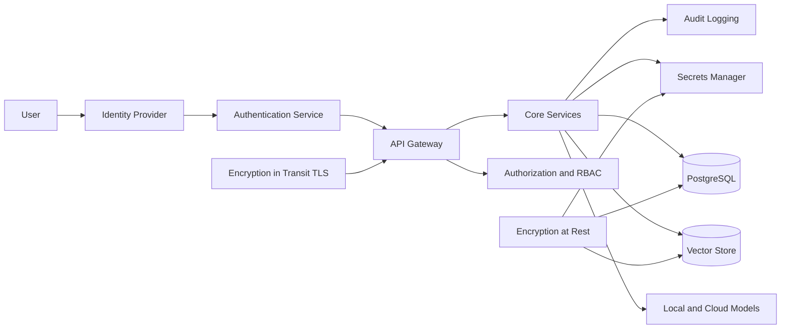

# Security

## Security Goals

OIP must protect user data, private knowledge, model credentials, and operational control planes while still supporting local-first and hybrid deployments.

## Security Architecture

## Authentication

Authentication should support:

- Local username and password for self-hosted simplicity
- OIDC or SAML federation for enterprise integration
- Service accounts for automation and trusted workloads
- Short-lived tokens for API access

Central authentication makes future product integration much easier because Delivery Wizard, PortalOps AI, EventEase, and WorkTime can rely on the same identity foundation.

## Authorization

Authorization should be enforced at multiple layers:

- API scope and endpoint access
- Workspace membership
- Knowledge base access classification
- Tool and agent capability permissions
- Administrative policy changes

## RBAC Model

Recommended baseline roles:

- Platform Admin
- Workspace Admin
- Contributor
- Knowledge Curator
- Viewer
- Automation Account

RBAC should be additive and policy-driven. Enterprises can later extend the role model with ABAC or group synchronization.

## Secrets Management

Secrets include:

- Cloud provider API keys
- Database credentials
- Signing keys
- SMTP or notification credentials
- Connector tokens

Use environment-backed secret stores for local deployments and dedicated secret managers in production Kubernetes environments. Secrets must never be embedded in source code or persisted in logs.

## Audit Logging

Audit logs should capture:

- Authentication events
- Privilege changes
- Provider configuration changes
- Knowledge ingestion and deletion
- Agent executions
- Model invocations with non-sensitive metadata
- Dataset approvals and training actions

Audit trails are essential for trust, incident analysis, and compliance.

## Encryption at Rest

Encryption at rest should cover:

- PostgreSQL volumes
- Vector store storage
- Object storage for datasets and artifacts
- Secret stores
- Backup media

## Encryption in Transit

TLS should protect:

- Browser to gateway traffic
- Service-to-service traffic where feasible
- Calls to cloud providers
- Replication and backup channels

## Why This Matters

- Hybrid AI platforms expand the attack surface across local and cloud systems.
- Knowledge and interaction data can contain highly sensitive information.
- Security design must scale from single-user deployment to enterprise environments without fundamental changes.
